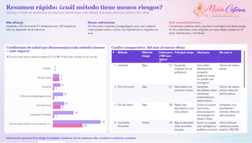
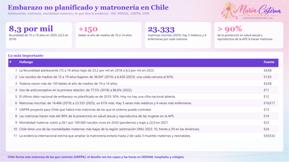
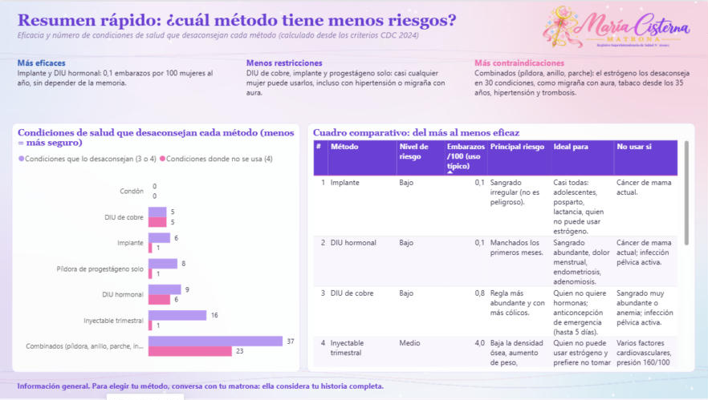
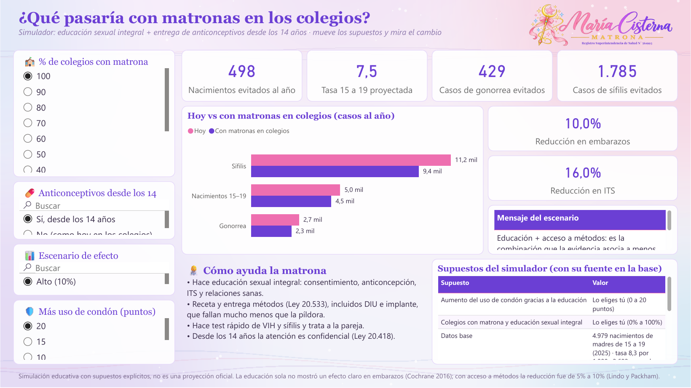
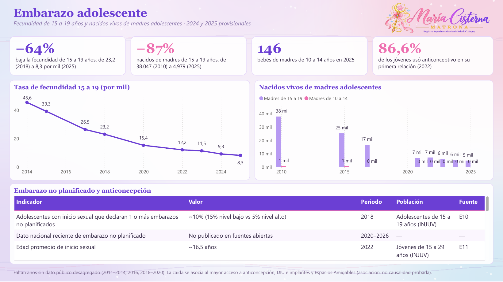
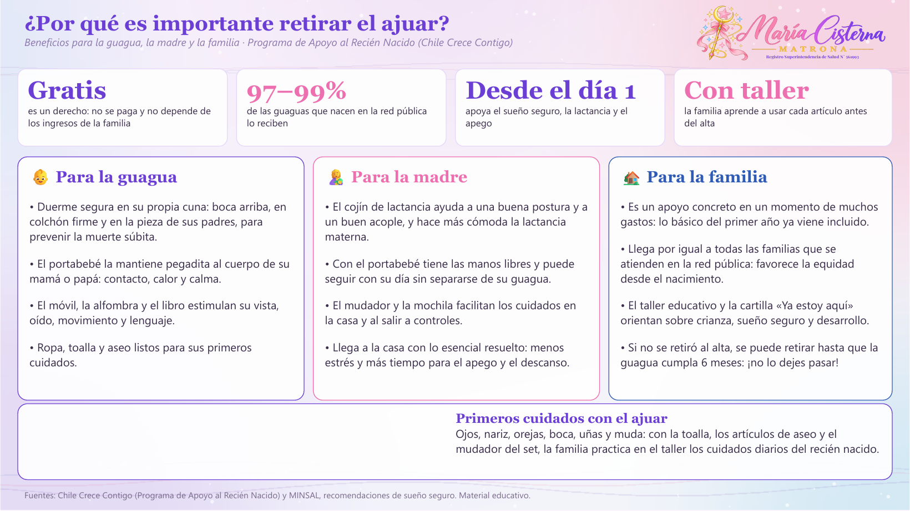
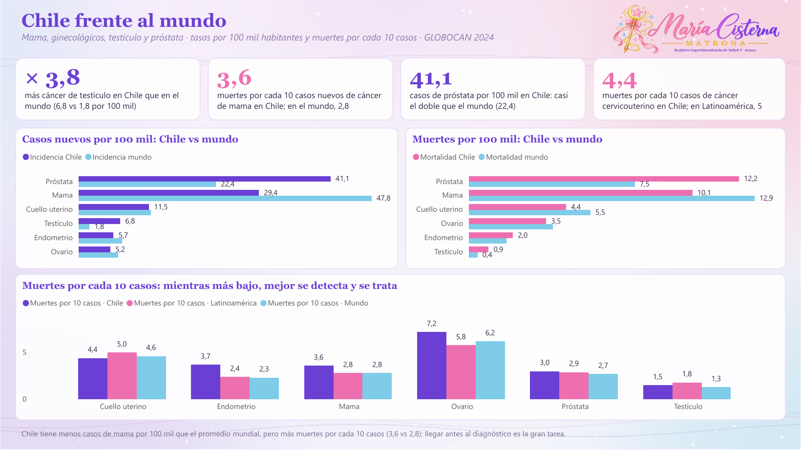

<h1 align="center">Análisis de datos en salud · Dashboards</h1>

<b>María Cisterna Escobar · Matrona</b> Registro Superintendencia de Salud N° 561993

---

## Sobre este repositorio

Tableros de análisis de datos sobre salud sexual y reproductiva en Chile, hechos desde la mirada de una matrona. Cada tablero responde una pregunta concreta con **indicadores de salud (KPI)** explicados —cómo se calculan, qué evalúan y por qué importan—, gráficos interactivos, ilustraciones con teoría y fuentes públicas citadas (MINSAL, DEIS, INE, ISP, OMS/OPS, IARC).

Cada tablero existe en **Power BI y en Tableau**, con las mismas páginas, y cada carpeta trae su propio README con capturas, KPI, base de datos y fuentes.

---

## Tableros

| Vista | Tablero | Pregunta que responde | KPI destacados |
|:---:|---|---|---|
|  | [Anticonceptivos en Chile](dashboard-anticonceptivos-chile/) | ¿Qué método me sirve y qué tan eficaz es? | Eficacia en uso típico y perfecto, seguridad |
|  | [ITS en Chile](dashboard-its-chile/) | ¿Están aumentando las ITS y cómo se previenen? | Tasa por 100 mil, cascada 95-95-95, sífilis congénita |
|  | [Embarazo y matronería](dashboard-embarazo-matronas-chile/) | ¿Qué pasa con el embarazo adolescente y las matronas? | Fecundidad 15 a 19 (ODS 3.7.2), mortalidad materna (ODS 3.1.1) |
|  | [Ajuar Chile Crece Contigo](dashboard-ajuar-chile-crece-contigo/) | ¿Llega el ajuar a todas las guaguas y por qué importa? | Cobertura, costo por set, ejecución presupuestaria |
|  | [Cáncer en Chile](dashboard-cancer-chile/) | ¿Cuánto aumenta el cáncer y cómo le ganamos? | Incidencia, razón mortalidad/incidencia, cobertura de tamizaje |

---

## Simuladores interactivos

En **ITS** y en **Embarazo y matronería** hay un simulador: eliges qué porcentaje de colegios tendría una matrona haciendo educación sexual integral, si se entregan anticonceptivos desde los 14 años y cuánto sube el uso de condón, y el tablero calcula cuántos embarazos adolescentes y casos de ITS se evitarían, con los supuestos y su evidencia a la vista.

 

---

## Una mirada a cada tablero

### [Anticonceptivos en Chile](dashboard-anticonceptivos-chile/)

### [ITS en Chile](dashboard-its-chile/)

### [Embarazo y matronería](dashboard-embarazo-matronas-chile/)

### [Ajuar Chile Crece Contigo](dashboard-ajuar-chile-crece-contigo/)

### [Cáncer en Chile](dashboard-cancer-chile/)

---

## Cómo elegí los KPI

- **Tasas** (por 100 mil o por 1.000): permiten comparar años, regiones y países aunque tengan distinta población.
- **Coberturas:** qué parte de la población objetivo recibe una intervención (mamografía, PAP, vacuna VPH, ajuar).
- **Razones:** comparan grupos (hombres y mujeres) o muertes por cada caso nuevo, que refleja el acceso a diagnóstico y tratamiento.
- **Metas oficiales:** ODS, ONUSIDA 95-95-95, OPS (eliminación de la transmisión vertical) y OMS 90-70-90 para cáncer cervicouterino.

---

## Qué trae cada carpeta

| Archivo | Qué es |
|---|---|
| `.pbix` | Tablero de **Power BI**, listo para abrir con Power BI Desktop (gratis). |
| `.twbx` | Tablero de **Tableau** con las mismas páginas. |
| `PowerBI_proyecto_pbip.zip` | **Proyecto editable** de Power BI (PBIP). |
| `_BaseDatos.xlsx` | **Base de datos** con todas las tablas, la hoja `KPI` y la hoja `Fuentes`. |
| `capturas/` | Imágenes de cada página, en Power BI y en Tableau. |

En `recursos/` están el logo con el registro de la Superintendencia de Salud y el fondo usado en los tableros.

---

## Cómo trabajé los datos

- **Fuentes públicas y chilenas primero:** MINSAL, DEIS, INE, ISP, Superintendencia de Salud, Chile Crece Contigo, OMS/OPS e IARC.
- **Cada fila dice de dónde viene** (columna `FuenteID`).
- **No se inventaron cifras:** si un año no tiene dato público, queda en blanco.
- **Lenguaje simple:** pensado para que lo entienda cualquier persona, no solo profesionales de salud.

---

## Aviso

Material educativo y de análisis de datos. **No reemplaza la consejería ni el control con un profesional de salud.**

## Derechos

© 2026 María Cisterna Escobar, matrona. Todos los derechos reservados: puedes ver y compartir el enlace, pero no copiar ni reutilizar el contenido sin autorización. Ver `LICENSE`.
