

<h1 align="center">📊 Análisis de datos en salud · Dashboards</h1>

<b>María Cisterna Escobar · Matrona</b> Registro Superintendencia de Salud N° 561993

<a href="#anticonceptivos">💊 Anticonceptivos en Chile</a> · <a href="#its">🩺 ITS en Chile</a> · <a href="#embarazo">🤰 Embarazo y matronería</a> · <a href="#ajuar">🍼 Ajuar Chile Crece Contigo</a> · <a href="#cancer">🎗️ Cáncer en Chile</a> · <a href="#presentacion">🎤 Presentación</a>

---

## 🌸 Sobre este repositorio

Tableros de análisis de datos sobre salud sexual y reproductiva en Chile, hechos desde la mirada de una matrona. Cada tablero responde una pregunta concreta con **indicadores de salud (KPI)** explicados —cómo se calculan, qué evalúan y por qué importan—, gráficos interactivos, ilustraciones con teoría y fuentes públicas citadas (MINSAL, DEIS, INE, ISP, OMS/OPS, IARC).

> 👀 **¿No tienes Power BI ni Tableau?** No importa: aquí abajo están **todas las páginas en imágenes**. Haz clic en cualquier miniatura para verla en grande, y abre «🎨 Ver en Tableau» para comparar. Para usar los filtros y controles, descarga el `.pbix` (Power BI Desktop, gratis) o el `.twbx` (Tableau Public, gratis).

---

## 🗂️ Los cinco tableros

| Vista | Tablero | Pregunta que responde | KPI destacados |
|:---:|---|---|---|
|  | 💊 [Anticonceptivos en Chile](dashboard-anticonceptivos-chile/) | ¿Qué método me sirve y qué tan eficaz es? | Tasa de falla en uso típico · riesgo de trombosis · elegibilidad OMS/CDC · uso de métodos en Chile |
|  | 🩺 [ITS en Chile](dashboard-its-chile/) | ¿Están aumentando las ITS y dónde está Chile frente al mundo? | 10 ITS · tasa por 100 mil · cascada VIH 95-95-95 · sífilis congénita |
|  | 🤰 [Embarazo y matronería](dashboard-embarazo-matronas-chile/) | ¿Qué pasa con el embarazo adolescente y las matronas? | Fecundidad de 15 a 19 (ODS 3.7.2) · mortalidad materna (ODS 3.1.1) · matronas por habitante |
|  | 🍼 [Ajuar Chile Crece Contigo](dashboard-ajuar-chile-crece-contigo/) | ¿Llega el ajuar a todas las guaguas y por qué importa? | Cobertura · costo por set · ejecución presupuestaria |
|  | 🎗️ [Cáncer en Chile](dashboard-cancer-chile/) | ¿Cuánto aumenta el cáncer y cómo le ganamos? | Incidencia · razón mortalidad/incidencia · cobertura de tamizaje |

---

## 💊 Anticonceptivos en Chile

**¿Qué método me sirve y qué tan eficaz es?** · Tasa de falla en uso típico · riesgo de trombosis · elegibilidad OMS/CDC · uso de métodos en Chile

**📊 Todas las páginas en Power BI** (13) · haz clic para ampliar

<table>
<tr><td align="center" valign="top"> 📊 Resumen rápido</td><td align="center" valign="top"> 🌱 Métodos 1: larga duración</td><td align="center" valign="top"> 💊 Métodos 2: corta duración</td><td align="center" valign="top"> 🎯 Eficacia</td></tr>
<tr><td align="center" valign="top"> 🛡️ Seguridad</td><td align="center" valign="top"> ✨ Beneficios</td><td align="center" valign="top"> 🔎 Mi pastilla</td><td align="center" valign="top"> 🩺 Según tu condición</td></tr>
<tr><td align="center" valign="top"> 🧬 Hormonas</td><td align="center" valign="top"> ✅ ¿Puedo usarlo?</td><td align="center" valign="top"> ⚠️ ¿Qué baja la eficacia?</td><td align="center" valign="top"> 🇨🇱 Chile</td></tr>
<tr><td align="center" valign="top"> 📐 Qué mide cada KPI</td></tr>
</table>

🎨 <b>Ver en Tableau</b> (mismas páginas)

<table>
<tr><td align="center" valign="top"> 📊 Resumen rápido</td><td align="center" valign="top"> 🌱 Métodos 1: larga duración</td><td align="center" valign="top"> 💊 Métodos 2: corta duración</td><td align="center" valign="top"> 🎯 Eficacia</td></tr>
<tr><td align="center" valign="top"> 🛡️ Seguridad</td><td align="center" valign="top"> ✨ Beneficios</td><td align="center" valign="top"> 🔎 Mi pastilla</td><td align="center" valign="top"> 🩺 Según tu condición</td></tr>
<tr><td align="center" valign="top"> 🧬 Hormonas</td><td align="center" valign="top"> ✅ ¿Puedo usarlo?</td><td align="center" valign="top"> ⚠️ ¿Qué baja la eficacia?</td><td align="center" valign="top"> 🇨🇱 Chile</td></tr>
<tr><td align="center" valign="top"> 📐 Qué mide cada KPI</td></tr>
</table>

📖 <a href="dashboard-anticonceptivos-chile/">README del tablero</a> &nbsp;·&nbsp; 📥 <a href="dashboard-anticonceptivos-chile/Anticonceptivos_MariaCisterna.pbix">Power BI (.pbix)</a> &nbsp;·&nbsp; 📥 <a href="dashboard-anticonceptivos-chile/Anticonceptivos_MariaCisterna.twbx">Tableau (.twbx)</a> &nbsp;·&nbsp; 🗂️ <a href="dashboard-anticonceptivos-chile/Anticonceptivos_BaseDatos.xlsx">Base de datos</a> &nbsp;·&nbsp; <a href="#inicio">⬆️ Volver arriba</a>

---

## 🩺 ITS en Chile

**¿Están aumentando las ITS y dónde está Chile frente al mundo?** · 10 ITS · tasa por 100 mil · cascada VIH 95-95-95 · sífilis congénita

**📊 Todas las páginas en Power BI** (8) · haz clic para ampliar

<table>
<tr><td align="center" valign="top"> 📊 Resumen</td><td align="center" valign="top"> 📈 Tendencias</td><td align="center" valign="top"> 👥 ¿A quiénes afecta?</td><td align="center" valign="top"> 🌍 Chile y el mundo</td></tr>
<tr><td align="center" valign="top"> 🧪 Todas las ITS</td><td align="center" valign="top"> 📖 Guía de cada ITS</td><td align="center" valign="top"> 🏫 Simulador: matronas en colegios</td><td align="center" valign="top"> 📐 Qué mide cada KPI</td></tr>
</table>

🎨 <b>Ver en Tableau</b> (mismas páginas)

<table>
<tr><td align="center" valign="top"> 📊 Resumen</td><td align="center" valign="top"> 📈 Tendencias</td><td align="center" valign="top"> 👥 ¿A quiénes afecta?</td><td align="center" valign="top"> 🌍 Chile y el mundo</td></tr>
<tr><td align="center" valign="top"> 🧪 Todas las ITS</td><td align="center" valign="top"> 📖 Guía de cada ITS</td><td align="center" valign="top"> 🏫 Simulador: matronas en colegios</td><td align="center" valign="top"> 📐 Qué mide cada KPI</td></tr>
</table>

📖 <a href="dashboard-its-chile/">README del tablero</a> &nbsp;·&nbsp; 📥 <a href="dashboard-its-chile/ITS_Chile_MariaCisterna.pbix">Power BI (.pbix)</a> &nbsp;·&nbsp; 📥 <a href="dashboard-its-chile/ITS_Chile_MariaCisterna.twbx">Tableau (.twbx)</a> &nbsp;·&nbsp; 🗂️ <a href="dashboard-its-chile/ITS_Chile_BaseDatos.xlsx">Base de datos</a> &nbsp;·&nbsp; <a href="#inicio">⬆️ Volver arriba</a>

---

## 🤰 Embarazo y matronería

**¿Qué pasa con el embarazo adolescente y las matronas?** · Fecundidad de 15 a 19 (ODS 3.7.2) · mortalidad materna (ODS 3.1.1) · matronas por habitante

**📊 Todas las páginas en Power BI** (8) · haz clic para ampliar

<table>
<tr><td align="center" valign="top"> 📊 Resumen</td><td align="center" valign="top"> 👧 Embarazo adolescente</td><td align="center" valign="top"> 🩺 Matronas en Chile</td><td align="center" valign="top"> ❤️ Mortalidad materna y neonatal</td></tr>
<tr><td align="center" valign="top"> 🔬 Lo que dice la evidencia</td><td align="center" valign="top"> 💡 Propuestas</td><td align="center" valign="top"> 🏫 Simulador: matronas en colegios</td><td align="center" valign="top"> 📐 Qué mide cada KPI</td></tr>
</table>

🎨 <b>Ver en Tableau</b> (mismas páginas)

<table>
<tr><td align="center" valign="top"> 📊 Resumen</td><td align="center" valign="top"> 👧 Embarazo adolescente</td><td align="center" valign="top"> 🩺 Matronas en Chile</td><td align="center" valign="top"> ❤️ Mortalidad materna y neonatal</td></tr>
<tr><td align="center" valign="top"> 🔬 Lo que dice la evidencia</td><td align="center" valign="top"> 💡 Propuestas</td><td align="center" valign="top"> 🏫 Simulador: matronas en colegios</td><td align="center" valign="top"> 📐 Qué mide cada KPI</td></tr>
</table>

📖 <a href="dashboard-embarazo-matronas-chile/">README del tablero</a> &nbsp;·&nbsp; 📥 <a href="dashboard-embarazo-matronas-chile/Embarazo_Matronas_MariaCisterna.pbix">Power BI (.pbix)</a> &nbsp;·&nbsp; 📥 <a href="dashboard-embarazo-matronas-chile/Embarazo_Matronas_MariaCisterna.twbx">Tableau (.twbx)</a> &nbsp;·&nbsp; 🗂️ <a href="dashboard-embarazo-matronas-chile/Embarazo_Matronas_BaseDatos.xlsx">Base de datos</a> &nbsp;·&nbsp; <a href="#inicio">⬆️ Volver arriba</a>

---

## 🍼 Ajuar Chile Crece Contigo

**¿Llega el ajuar a todas las guaguas y por qué importa?** · Cobertura · costo por set · ejecución presupuestaria

**📊 Todas las páginas en Power BI** (7) · haz clic para ampliar

<table>
<tr><td align="center" valign="top"> 📊 Resumen</td><td align="center" valign="top"> 📦 Entregas y cobertura</td><td align="center" valign="top"> 💰 Presupuesto</td><td align="center" valign="top"> 🔗 Cadena logística</td></tr>
<tr><td align="center" valign="top"> 🎁 ¿Qué contiene?</td><td align="center" valign="top"> 💜 ¿Por qué es importante?</td><td align="center" valign="top"> 📐 Qué mide cada KPI</td></tr>
</table>

🎨 <b>Ver en Tableau</b> (mismas páginas)

<table>
<tr><td align="center" valign="top"> 📊 Resumen</td><td align="center" valign="top"> 📦 Entregas y cobertura</td><td align="center" valign="top"> 💰 Presupuesto</td><td align="center" valign="top"> 🔗 Cadena logística</td></tr>
<tr><td align="center" valign="top"> 🎁 ¿Qué contiene?</td><td align="center" valign="top"> 💜 ¿Por qué es importante?</td><td align="center" valign="top"> 📐 Qué mide cada KPI</td></tr>
</table>

📖 <a href="dashboard-ajuar-chile-crece-contigo/">README del tablero</a> &nbsp;·&nbsp; 📥 <a href="dashboard-ajuar-chile-crece-contigo/Ajuar_PARN_MariaCisterna.pbix">Power BI (.pbix)</a> &nbsp;·&nbsp; 📥 <a href="dashboard-ajuar-chile-crece-contigo/Ajuar_PARN_MariaCisterna.twbx">Tableau (.twbx)</a> &nbsp;·&nbsp; 🗂️ <a href="dashboard-ajuar-chile-crece-contigo/Ajuar_PARN_BaseDatos.xlsx">Base de datos</a> &nbsp;·&nbsp; <a href="#inicio">⬆️ Volver arriba</a>

---

## 🎗️ Cáncer en Chile

**¿Cuánto aumenta el cáncer y cómo le ganamos?** · Incidencia · razón mortalidad/incidencia · cobertura de tamizaje

**📊 Todas las páginas en Power BI** (9) · haz clic para ampliar

<table>
<tr><td align="center" valign="top"> 📊 Resumen</td><td align="center" valign="top"> 📈 ¿Está aumentando?</td><td align="center" valign="top"> ⚖️ ¿Cuál predomina?</td><td align="center" valign="top"> 🛡️ Cómo prevenirlo</td></tr>
<tr><td align="center" valign="top"> 🌍 Chile y el mundo</td><td align="center" valign="top"> 🌸 Cáncer de mama</td><td align="center" valign="top"> 💠 Cuello uterino</td><td align="center" valign="top"> 🔎 Detectarlo a tiempo</td></tr>
<tr><td align="center" valign="top"> 📐 Qué mide cada KPI</td></tr>
</table>

🎨 <b>Ver en Tableau</b> (mismas páginas)

<table>
<tr><td align="center" valign="top"> 📊 Resumen</td><td align="center" valign="top"> 📈 ¿Está aumentando?</td><td align="center" valign="top"> ⚖️ ¿Cuál predomina?</td><td align="center" valign="top"> 🛡️ Cómo prevenirlo</td></tr>
<tr><td align="center" valign="top"> 🌍 Chile y el mundo</td><td align="center" valign="top"> 🌸 Cáncer de mama</td><td align="center" valign="top"> 💠 Cuello uterino</td><td align="center" valign="top"> 🔎 Detectarlo a tiempo</td></tr>
<tr><td align="center" valign="top"> 📐 Qué mide cada KPI</td></tr>
</table>

📖 <a href="dashboard-cancer-chile/">README del tablero</a> &nbsp;·&nbsp; 📥 <a href="dashboard-cancer-chile/Cancer_Chile_MariaCisterna.pbix">Power BI (.pbix)</a> &nbsp;·&nbsp; 📥 <a href="dashboard-cancer-chile/Cancer_Chile_MariaCisterna.twbx">Tableau (.twbx)</a> &nbsp;·&nbsp; 🗂️ <a href="dashboard-cancer-chile/Cancer_Chile_BaseDatos.xlsx">Base de datos</a> &nbsp;·&nbsp; <a href="#inicio">⬆️ Volver arriba</a>

---

## 🎤 Presentación: los cinco tableros en una mirada

<a href="presentacion/diapositivas/01_portada.png">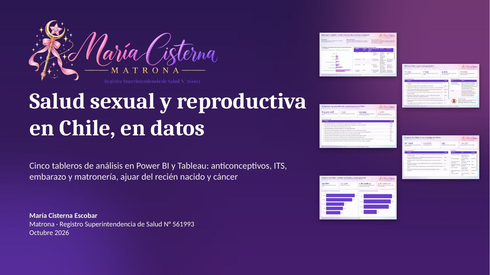</a>

[`Salud_Chile_en_datos_MariaCisterna.pptx`](presentacion/Salud_Chile_en_datos_MariaCisterna.pptx) · 15 diapositivas interactivas: índice con tarjetas que llevan a cada sección, botón **Índice** en cada diapositiva y enlaces a cada tablero. Aquí están todas, haz clic para ampliar:

<table>
<tr><td align="center" valign="top"><a href="presentacion/diapositivas/02_indice.png">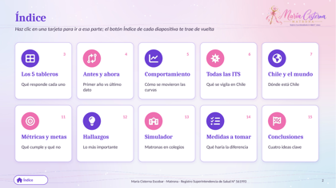</a> 🧭 Índice interactivo</td><td align="center" valign="top"><a href="presentacion/diapositivas/03_cinco_tableros.png">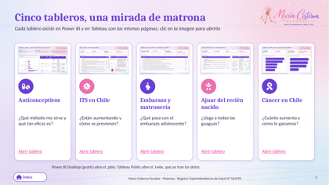</a> 🗂️ Los 5 tableros</td><td align="center" valign="top"><a href="presentacion/diapositivas/04_antes_y_ahora.png">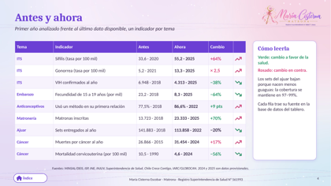</a> ⏳ Antes y ahora</td></tr>
<tr><td align="center" valign="top"><a href="presentacion/diapositivas/05_sifilis.png">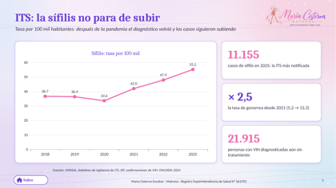</a> 📈 Sífilis: no para de subir</td><td align="center" valign="top"><a href="presentacion/diapositivas/06_todas_las_its.png">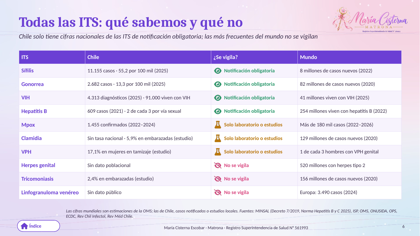</a> 🧪 Todas las ITS</td><td align="center" valign="top"><a href="presentacion/diapositivas/07_chile_mundo_its.png">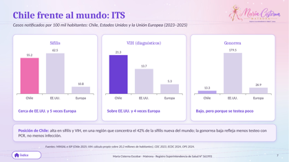</a> 🌍 Chile frente al mundo: ITS</td></tr>
<tr><td align="center" valign="top"><a href="presentacion/diapositivas/08_chile_mundo_cancer_materna.png">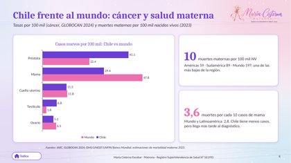</a> 🌎 Chile frente al mundo: cáncer y salud materna</td><td align="center" valign="top"><a href="presentacion/diapositivas/09_embarazo_matronas.png">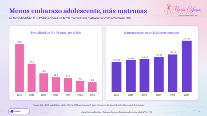</a> 🤰 Menos embarazo adolescente, más matronas</td><td align="center" valign="top"><a href="presentacion/diapositivas/10_cancer_ajuar.png">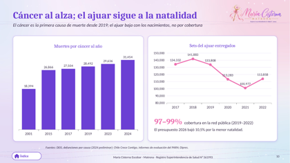</a> 🎗️ Cáncer y ajuar</td></tr>
<tr><td align="center" valign="top"><a href="presentacion/diapositivas/11_metricas_meta.png">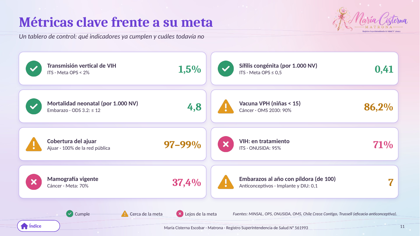</a> 🎯 Métricas frente a su meta</td><td align="center" valign="top"><a href="presentacion/diapositivas/12_hallazgos.png">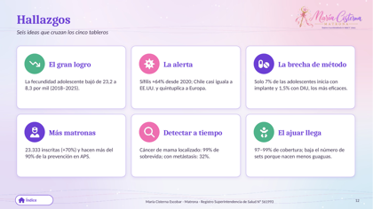</a> 💡 Hallazgos</td><td align="center" valign="top"><a href="presentacion/diapositivas/13_simulador.png">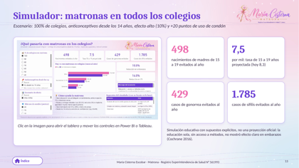</a> 🏫 Simulador</td></tr>
<tr><td align="center" valign="top"><a href="presentacion/diapositivas/14_medidas.png">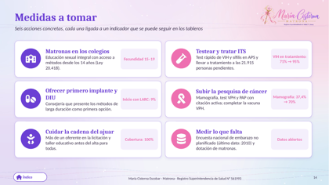</a> 🛠️ Medidas a tomar</td><td align="center" valign="top"><a href="presentacion/diapositivas/15_conclusiones.png">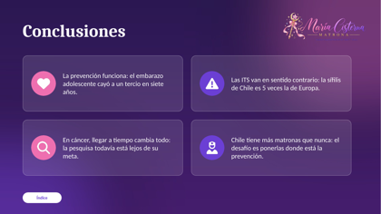</a> ✅ Conclusiones</td></tr>
</table>

---

## 🏫 Simuladores interactivos

En **ITS** y en **Embarazo y matronería** hay un simulador: eliges qué porcentaje de colegios tendría una matrona haciendo educación sexual integral, si se entregan anticonceptivos desde los 14 años y cuánto sube el uso de condón, y el tablero calcula cuántos embarazos adolescentes y casos de ITS se evitarían, con los supuestos y su evidencia a la vista.

 

---

## 📐 Cómo elegí los KPI

- 📏 **Tasas** (por 100 mil o por 1.000): permiten comparar años, regiones y países aunque tengan distinta población.
- ✅ **Coberturas:** qué parte de la población objetivo recibe una intervención (mamografía, PAP, vacuna VPH, ajuar).
- ⚖️ **Razones:** comparan grupos (hombres y mujeres) o muertes por cada caso nuevo, que refleja el acceso a diagnóstico y tratamiento.
- 🎯 **Metas oficiales:** ODS, ONUSIDA 95-95-95, OPS (eliminación de la transmisión vertical) y OMS 90-70-90 para cáncer cervicouterino.

---

## 📁 Qué trae cada carpeta

| | Archivo | Qué es |
|:---:|---|---|
| 📊 | `.pbix` | Tablero de **Power BI**, listo para abrir con Power BI Desktop (gratis). |
| 🎨 | `.twbx` | Tablero de **Tableau** con las mismas páginas. |
| 🧩 | `PowerBI_proyecto_pbip.zip` | **Proyecto editable** de Power BI (PBIP). |
| 🗂️ | `_BaseDatos.xlsx` | **Base de datos** con todas las tablas, la hoja `KPI` y la hoja `Fuentes`. |
| 🖼️ | `capturas/` | Imágenes de cada página, en Power BI y en Tableau. |

En `recursos/` están el logo con el registro de la Superintendencia de Salud y el fondo de los tableros (`fondo_tableros.png`).

---

## 🧭 Cómo trabajé los datos

- 🔎 **Fuentes públicas y chilenas primero:** MINSAL, DEIS, INE, ISP, Superintendencia de Salud, Chile Crece Contigo, OMS/OPS e IARC.
- 🧾 **Cada fila dice de dónde viene** (columna `FuenteID`).
- 🚫 **No se inventaron cifras:** si un año no tiene dato público, queda en blanco.
- 💬 **Lenguaje simple:** pensado para que lo entienda cualquier persona, no solo profesionales de salud.

---

## ⚠️ Aviso

Material educativo y de análisis de datos. **No reemplaza la consejería ni el control con un profesional de salud.**

## ©️ Derechos

© 2026 María Cisterna Escobar, matrona. Todos los derechos reservados: puedes ver y compartir el enlace, pero no copiar ni reutilizar el contenido sin autorización. Ver `LICENSE`.
