

<h1 align="center">🍼 El ajuar de Chile Crece Contigo (PARN)</h1>

<b>María Cisterna Escobar · Matrona</b> — Registro Superintendencia de Salud N° 561993

<a href="capturas/02_entregas_y_cobertura.png">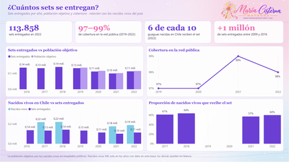</a> <a href="capturas/03_presupuesto.png">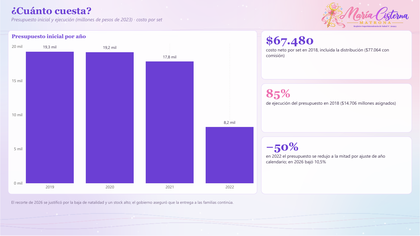</a> <a href="capturas/04_cadena_logistica.png">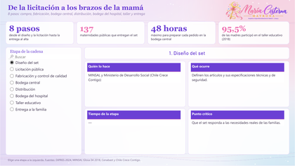</a> <a href="capturas/05_que_contiene.png">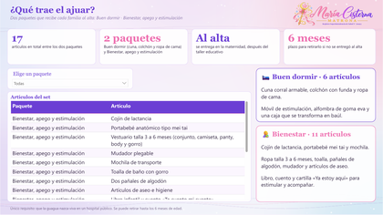</a> <a href="capturas/06_por_que_es_importante.png">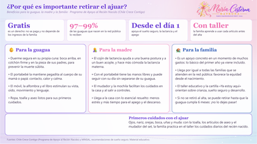</a> <a href="capturas/07_que_mide_cada_kpi.png">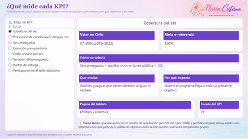</a>

---

## ✨ ¿Qué muestra?

      

El Programa de Apoyo al Recién Nacido en datos: cuántos sets se entregan y su cobertura, cuánto cuesta, la cadena logística de la licitación a la familia, qué trae el ajuar y **por qué es importante retirarlo** para la guagua, la madre y la familia.

Cada página parte con sus **indicadores clave (KPI)** y una página final explica **qué mide cada KPI, cómo se calcula y por qué importa**. Power BI y Tableau tienen las mismas páginas.

---

## 🔍 Qué investigué

Revisé las evaluaciones de DIPRES, la glosa presupuestaria del MINSAL, Cenabast, Chile Crece Contigo y los nacidos vivos del INE para entender cuánto llega el ajuar y cuánto cuesta.

## 💡 Lo que observé

- 🍼 Entre 97% y 99% de las guaguas que nacen en la red pública recibe el set (2019–2022).
- 📉 Los sets entregados bajan (141.883 en 2018, 113.858 en 2022) porque nacen menos guaguas, no porque falle el programa.
- 💰 Cada set cuesta cerca de $67.480 y la ejecución del presupuesto fue 85% en 2018; en 2026 el presupuesto bajó 10,5%.
- 🎓 95,5% de las madres participa en el taller educativo, donde aprende sueño seguro, lactancia y cuidados.

## 🎯 Lo que concluyo

> El ajuar llega a casi todas las familias de la red pública; cuidar la cadena de compra y el taller es lo que mantiene ese logro.

---

## 📌 KPI que uso y por qué

| KPI | Valor en Chile | Cómo se calcula | Qué evalúa | Por qué importa | Meta o referencia |
|---|---|---|---|---|---|
| **Cobertura del set** | 97–99% (2019–2022) | Sets entregados ÷ nacidos vivos en la red pública × 100 | Cuántas guaguas que tienen derecho al ajuar lo reciben | Mide si el programa llega a toda su población objetivo | 100% |
| **Proporción de nacidos vivos del país con set** | 60,1% (2022) | Sets entregados ÷ nacidos vivos en Chile × 100 | Alcance del programa en todo el país | El resto nace en clínicas privadas, que no entregan el set | — |
| **Sets entregados** | 113.858 (2022) | Número de sets entregados en el año | Producción del programa | Se ajusta a la natalidad: bajó de 141.883 (2018) a 100.977 (2021) | — |
| **Ejecución presupuestaria** | 85% (2018) | Gasto ejecutado ÷ presupuesto asignado × 100 | Qué parte del dinero asignado se usó | Un valor bajo puede indicar compras atrasadas o sobrestock | Cercano a 100% |
| **Costo unitario por set** | $67.480 neto (2018) | Costo total de compra y distribución ÷ sets | Cuánto cuesta cada ajuar | Permite evaluar eficiencia y comparar licitaciones | — |
| **Variación del presupuesto** | −10,5% (2026) | (Presupuesto del año − año anterior) ÷ año anterior × 100 | Cuánto cambia el financiamiento | Se justificó por la baja de natalidad y el stock alto | Garantizar la entrega |
| **Puntos de entrega** | 137 maternidades | Número de maternidades públicas que entregan el set | Acceso territorial al programa | Más puntos de entrega = más familias lo reciben al alta | Todas las maternidades públicas |
| **Participación en el taller educativo** | 95,5% (2018) | Madres que asistieron al taller ÷ madres que recibieron el set × 100 | Si la familia aprende a usar cada artículo | El taller de la matrona es el paso que da sentido al ajuar: sueño seguro, lactancia y apego | 100% |

---

## 🧭 Páginas del tablero

| Vista | Página | Qué encuentras |
|:---:|---|---|
| <a href="capturas/01_resumen.png">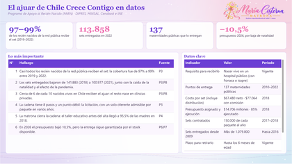</a> | 📊 **Resumen** | Indicadores clave, hallazgos y datos clave. |
|  | 📦 **Entregas y cobertura** | Sets por año, cobertura y nacidos vivos. |
|  | 💰 **Presupuesto** | Presupuesto, costo por set y ejecución. |
|  | 🔗 **Cadena logística** | Las 8 etapas: quién, qué, cuánto tarda y punto crítico. |
|  | 🎁 **¿Qué contiene?** | Los 17 artículos de los dos paquetes. |
|  | 💜 **¿Por qué es importante?** | Beneficios y primeros cuidados del recién nacido. |
|  | 📐 **Qué mide cada KPI** | Fórmula, qué evalúa, por qué importa y meta. |
| | 📚 **Fuentes** | Referencias de cada cifra. |

---

## 📊 Vista del tablero en Power BI

### 📊 Resumen

Indicadores clave, hallazgos y datos clave.

### 📦 Entregas y cobertura

Sets por año, cobertura y nacidos vivos.

### 💰 Presupuesto

Presupuesto, costo por set y ejecución.

### 🔗 Cadena logística

Las 8 etapas: quién, qué, cuánto tarda y punto crítico.

### 🎁 ¿Qué contiene?

Los 17 artículos de los dos paquetes.

### 💜 ¿Por qué es importante?

Beneficios y primeros cuidados del recién nacido.

### 📐 Qué mide cada KPI

Fórmula, qué evalúa, por qué importa y meta.

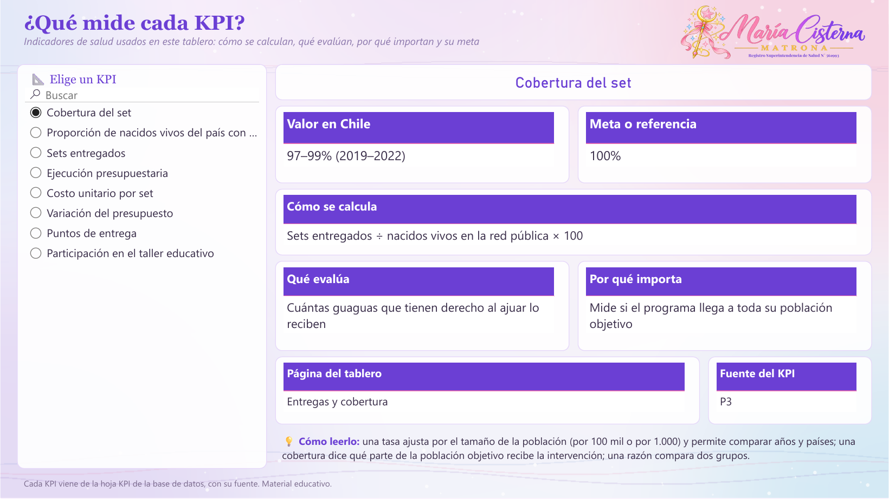

## 🎨 Vista del tablero en Tableau

El `.twbx` tiene las mismas páginas, con filtros, listas desplegables y controles deslizantes.

📊 <b>Resumen</b>

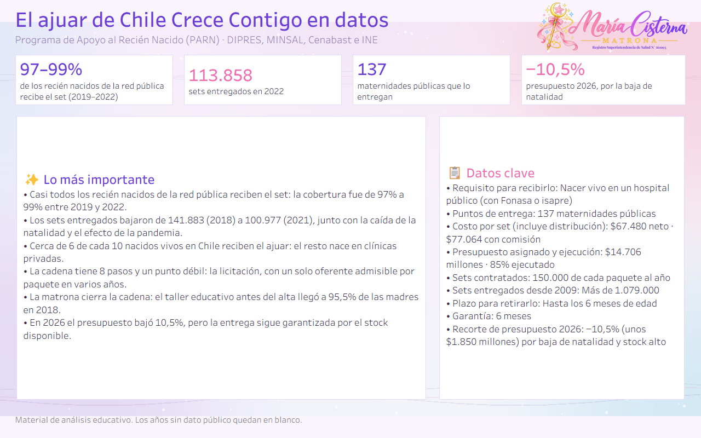

📦 <b>Entregas y cobertura</b>

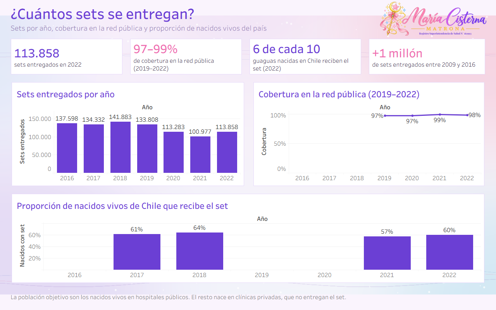

💰 <b>Presupuesto</b>

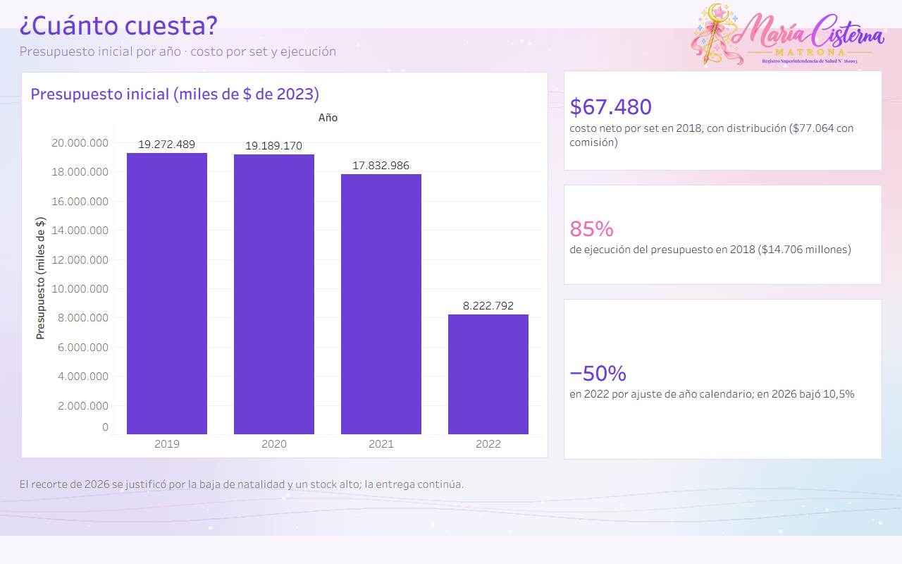

🔗 <b>Cadena logística</b>

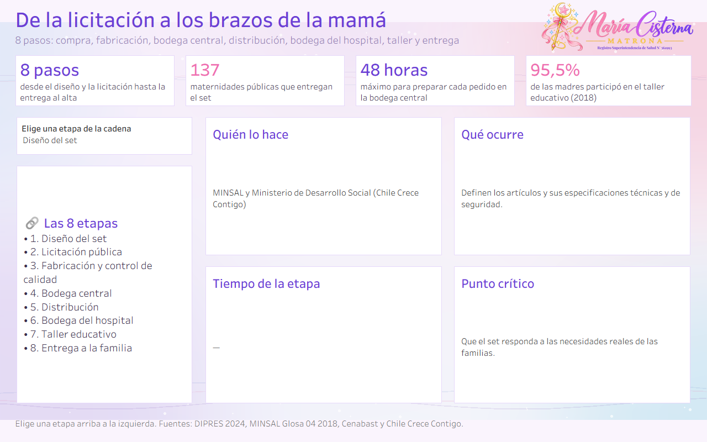

🎁 <b>¿Qué contiene?</b>

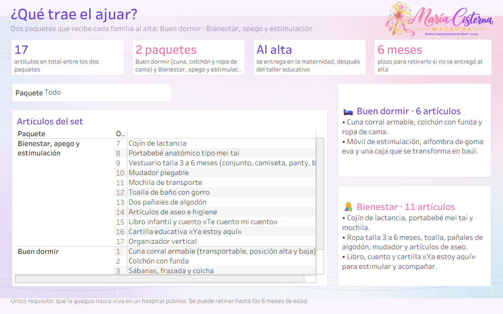

💜 <b>¿Por qué es importante?</b>

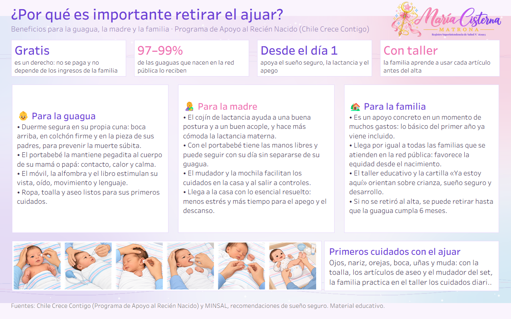

📐 <b>Qué mide cada KPI</b>

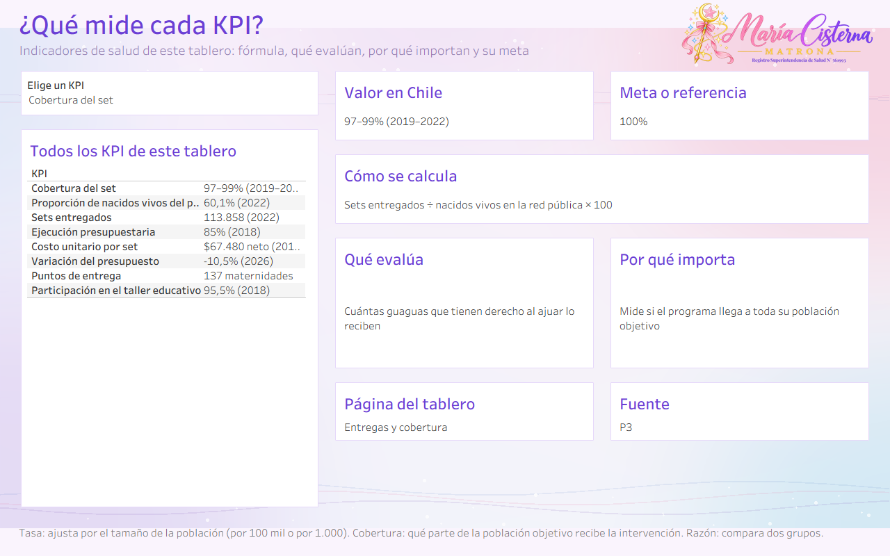

---

## 🎤 Presentación

La presentación [`Salud_Chile_en_datos_MariaCisterna.pptx`](../presentacion/Salud_Chile_en_datos_MariaCisterna.pptx) resume los cinco tableros: antes y ahora, Chile frente al mundo, métricas frente a sus metas, hallazgos, medidas y conclusiones.

---

## 📁 Archivos

| | Archivo | Qué es |
|:---:|---|---|
| 📊 | `Ajuar_PARN_MariaCisterna.pbix` | Tablero de **Power BI**. Ábrelo con Power BI Desktop (gratis). |
| 🎨 | `Ajuar_PARN_MariaCisterna.twbx` | Tablero de **Tableau**. Ábrelo con Tableau Public o Tableau Desktop. |
| 🧩 | `PowerBI_proyecto_pbip.zip` | **Proyecto editable** de Power BI (PBIP): descomprime y abre el `.pbip`. |
| 🗂️ | `Ajuar_PARN_BaseDatos.xlsx` | **Base de datos** con todas las tablas, la hoja `KPI` y la hoja `Fuentes`. |
| 🖼️ | `capturas/` | Imágenes de cada página en Power BI y en Tableau, y miniaturas en `capturas/mini/`. |
| 🎀 | `recursos/` | Logo con registro y fondo usados en los tableros. |

---

## 🛠️ Cómo abrirlo

1. Descarga el repositorio: botón verde **Code → Download ZIP** y descomprímelo.
2. **Power BI:** abre `Ajuar_PARN_MariaCisterna.pbix`. Para actualizar con tu copia del Excel: **Transformar datos → Administrar parámetros → RutaBaseDatos**, pega la ruta del `.xlsx` y aprieta **Actualizar**.
3. **Tableau:** abre `Ajuar_PARN_MariaCisterna.twbx`; los datos ya vienen incluidos.

> 💡 **Tip:** las listas de la izquierda, los menús desplegables y los controles deslizantes son interactivos: elige una opción y el tablero cambia.

---

## 🗂️ Base de datos

`Ajuar_PARN_BaseDatos.xlsx` trae estas hojas: `Entregas`, `Presupuesto`, `CadenaLogistica`, `Contenido`, `Indicadores`, `Hallazgos`, `KPI`, `KPILargo`, `Fuentes`.

Cada fila indica su fuente en la columna `FuenteID`. Si un año no tiene dato público, queda vacío: **no se inventaron cifras**.

---

## 📚 Fuentes

- **P1** · Chile Crece Contigo: Programa de Apoyo al Recién Nacido (contenido, requisitos y entrega). — [enlace](https://www.crececontigo.gob.cl/beneficios/programa-de-apoyo-al-recien-nacido/)
- **P2** · Chile Crece Contigo: requisitos para recibir el set de implementos del PARN. — [enlace](https://www.crececontigo.gob.cl/faqs/cuales-son-los-requisitos-para-recibir-el-set-de-implementos-del-parn/)
- **P3** · DIPRES, Ministerio de Hacienda: Evaluación focalizada de ámbito del Programa de Apoyo al Recién Nacido, informe final (marzo 2024; período 2010–2022). — [enlace](https://www.dipres.gob.cl/597/articles-341569_informe_final.pdf)
- **P4** · MINSAL: Programa de Apoyo al Recién Nacido(a), Informe Glosa 04 año 2018. — [enlace](https://www.minsal.cl/wp-content/uploads/2019/03/Glosa-4_PARN_2018.pdf)
- **P5** · Cenabast: Minsal y Cenabast entregan detalles del nuevo set de implementos para el recién nacido (2016). — [enlace](https://www.cenabast.cl/minsal-y-cenabast-entregan-detalles-para-el-nuevo-set-de-implementos-para-el-recien-nacidoa/)
- **P6** · BioBioChile: recorte al Ajuar para recién nacidos, qué incluye y por qué se redujo su presupuesto (30-04-2026). — [enlace](https://www.biobiochile.cl/noticias/bbcl-explica/bbcl-explica-notas/2026/04/30/recorte-al-ajuar-para-recien-nacidos-que-incluye-y-por-que-el-gobierno-redujo-su-presupuesto.shtml)
- **P7** · La Tercera: qué contiene el ajuar de recién nacidos que el gobierno aclaró que no se dejará de entregar (2026). — [enlace](https://www.latercera.com/nacional/noticia/que-contiene-el-ajuar-de-recien-nacidos-que-el-gobierno-aclaro-que-no-se-dejara-de-entregar-pese-a-recortes-presupuestarios/)
- **P8** · INE: Anuarios de Estadísticas Vitales (nacidos vivos en Chile). — [enlace](https://www.ine.gob.cl/estadisticas/sociales/demografia-y-vitales/nacimientos-matrimonios-y-defunciones)

---

## ⚠️ Aviso

Material educativo y de análisis de datos. **No reemplaza la consejería ni el control con un profesional de salud.**

## ©️ Derechos

© 2026 María Cisterna Escobar, matrona. Todos los derechos reservados: puedes ver y compartir el enlace, pero no copiar ni reutilizar el contenido sin autorización. Ver `LICENSE`.
