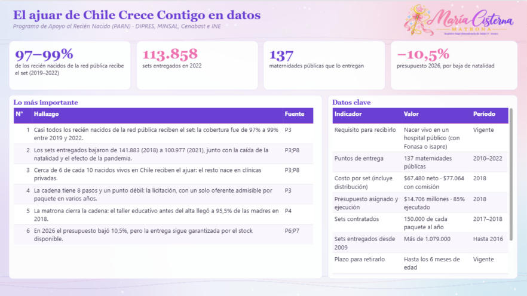
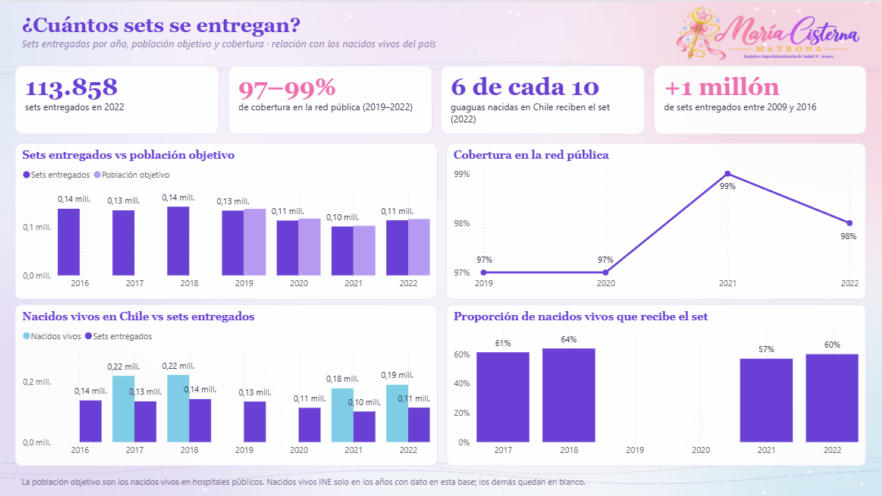
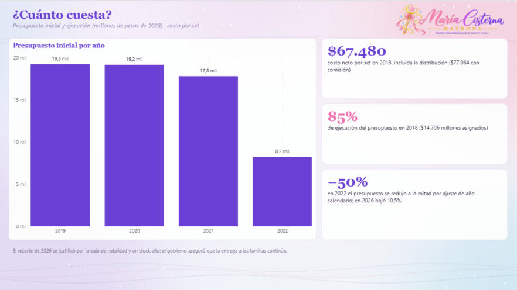
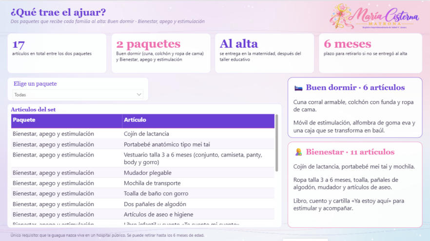

# 🍼 El ajuar de Chile Crece Contigo (PARN)

**María Cisterna Escobar · Matrona** — Registro Superintendencia de Salud N° 561993

   

---

## ✨ ¿Qué muestra?

Sets entregados y cobertura por año, presupuesto, cadena logística de la licitación a la familia (Cenabast, bodega central, distribución a 137 maternidades, bodega del hospital, taller de la matrona y entrega) y contenido del set. Fuentes DIPRES, MINSAL, Cenabast e INE. Tableau (`.twbx`) y base de datos (`.xlsx`).

> 🌙 **Historia de datos interactiva:** está en la página `capsula.html` de mi portafolio (repositorio **matrona**).

Cada página parte con sus indicadores clave (KPI). Incluye una página sobre **por qué es importante retirar el ajuar**: beneficios para la guagua, la madre y la familia, con ilustraciones de los primeros cuidados del recién nacido.

---

## 📌 Indicadores clave

| | Indicador | Qué significa |
|:---:|:---:|---|
| 🍼 | **113.858** | sets entregados en 2022 |
| ✅ | **97–99%** | de cobertura en la red pública |
| 👶 | **6 de cada 10** | guaguas nacidas en Chile reciben el set |
| 🏥 | **137** | maternidades públicas lo entregan |
| 🎁 | **17** | artículos en dos paquetes: Buen dormir y Bienestar |
| 💰 | **−10,5%** | presupuesto 2026, por la baja de natalidad |

---

## 🖼️ Vista del tablero

### Resumen

### Entregas y cobertura

### Presupuesto

### Cadena logística

### ¿Qué contiene?

### ¿Por qué es importante?

---

## 📁 Archivos

| | Archivo | Qué es |
|---|---|---|
| 🗂️ | `Ajuar_PARN_BaseDatos.xlsx` | **Base de datos** con todas las tablas y la hoja `Fuentes`. |
| 📊 | `Ajuar_PARN_MariaCisterna.pbix` | Tablero de **Power BI**. Ábrelo con Power BI Desktop (gratis). |
| 📈 | `Ajuar_PARN_MariaCisterna.twbx` | Tablero de **Tableau**. Ábrelo con Tableau Public o Tableau Reader (gratis). |
| 🧩 | `PowerBI_proyecto_pbip.zip` | **Proyecto editable** de Power BI (PBIP): descomprime y abre el `.pbip`. |

---

## 🧭 Páginas del tablero

1. **Resumen**
2. **Entregas y cobertura**
3. **Presupuesto**
4. **Cadena logística**
5. **¿Qué contiene?**
6. **¿Por qué es importante?**
7. **Fuentes**

---

## 🛠️ Cómo abrirlo

1. Descarga el repositorio: botón verde **Code → Download ZIP** y descomprímelo.
2. Abre `Ajuar_PARN_MariaCisterna.pbix` con **Power BI Desktop** (se descarga gratis desde Microsoft Store).
3. Si quieres actualizar los datos con tu copia del Excel: **Transformar datos → Administrar parámetros → RutaBaseDatos**, pega la ruta del `.xlsx` en tu computador y aprieta **Actualizar**.

> 💡 **Tip:** las páginas con lista a la izquierda son interactivas: elige una opción y el tablero cambia.

---

## 🗂️ Base de datos

`Ajuar_PARN_BaseDatos.xlsx` trae estas hojas: `Entregas`, `Presupuesto`, `CadenaLogistica`, `Contenido`, `Indicadores`, `Hallazgos`, `Fuentes`.

Cada fila indica su fuente en la columna `FuenteID`. Si un año no tiene dato público, queda vacío: **no se inventaron cifras**.

---

## 📚 Fuentes

- **P1** · Chile Crece Contigo: Programa de Apoyo al Recién Nacido (contenido, requisitos y entrega). — [enlace](https://www.crececontigo.gob.cl/beneficios/programa-de-apoyo-al-recien-nacido/)
- **P2** · Chile Crece Contigo: requisitos para recibir el set de implementos del PARN. — [enlace](https://www.crececontigo.gob.cl/faqs/cuales-son-los-requisitos-para-recibir-el-set-de-implementos-del-parn/)
- **P3** · DIPRES, Ministerio de Hacienda: Evaluación focalizada de ámbito del Programa de Apoyo al Recién Nacido, informe final (marzo 2024; período 2010–2022). — [enlace](https://www.dipres.gob.cl/597/articles-341569_informe_final.pdf)
- **P4** · MINSAL: Programa de Apoyo al Recién Nacido(a), Informe Glosa 04 año 2018. — [enlace](https://www.minsal.cl/wp-content/uploads/2019/03/Glosa-4_PARN_2018.pdf)
- **P5** · Cenabast: Minsal y Cenabast entregan detalles del nuevo set de implementos para el recién nacido (2016). — [enlace](https://www.cenabast.cl/minsal-y-cenabast-entregan-detalles-para-el-nuevo-set-de-implementos-para-el-recien-nacidoa/)
- **P6** · BioBioChile: recorte al Ajuar para recién nacidos, qué incluye y por qué se redujo su presupuesto (30-04-2026). — [enlace](https://www.biobiochile.cl/noticias/bbcl-explica/bbcl-explica-notas/2026/04/30/recorte-al-ajuar-para-recien-nacidos-que-incluye-y-por-que-el-gobierno-redujo-su-presupuesto.shtml)
- **P7** · La Tercera: qué contiene el ajuar de recién nacidos que el gobierno aclaró que no se dejará de entregar (2026). — [enlace](https://www.latercera.com/nacional/noticia/que-contiene-el-ajuar-de-recien-nacidos-que-el-gobierno-aclaro-que-no-se-dejara-de-entregar-pese-a-recortes-presupuestarios/)
- **P8** · INE: Anuarios de Estadísticas Vitales (nacidos vivos en Chile). — [enlace](https://www.ine.gob.cl/estadisticas/sociales/demografia-y-vitales/nacimientos-matrimonios-y-defunciones)

---

## ⚠️ Aviso

Material educativo y de análisis de datos. **No reemplaza la consejería ni el control con un profesional de salud.**

## ©️ Derechos

© 2026 María Cisterna Escobar, matrona. Todos los derechos reservados: puedes ver y compartir el enlace, pero no copiar ni reutilizar el contenido sin autorización. Ver `LICENSE`.
