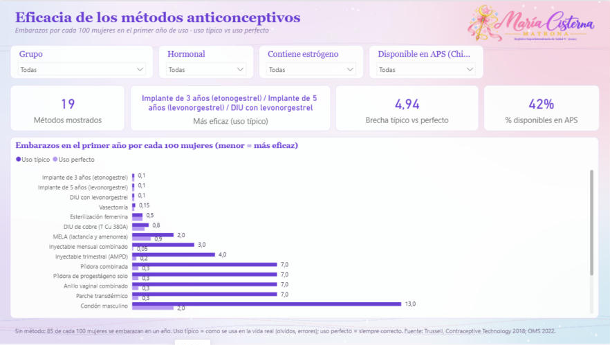
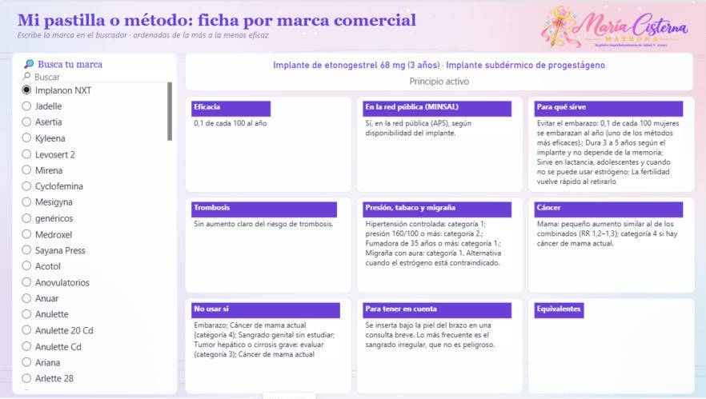
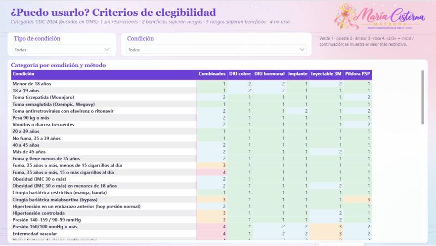
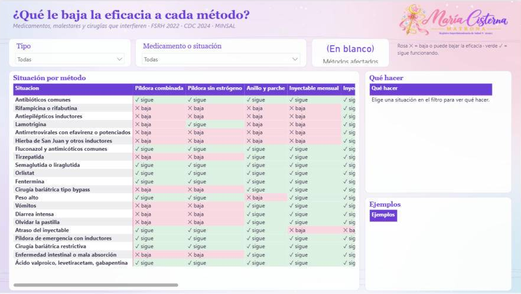
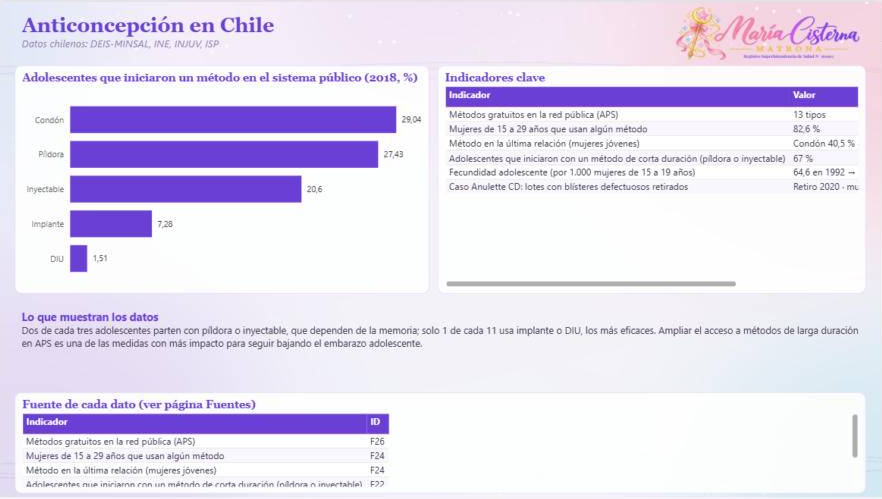

# 💊 Anticonceptivos en Chile

**María Cisterna Escobar · Matrona** — Registro Superintendencia de Salud N° 561993

   

---

## ✨ ¿Qué muestra?

Resumen de menor a mayor riesgo, eficacia, seguridad, beneficios, «Mi pastilla» con buscador (más de 140 marcas que se venden en Chile, de la más a la menos eficaz, con disponibilidad en la red pública según MINSAL), según tu condición, hormonas, ¿puedo usarlo? (incluye obesidad, cirugía bariátrica, cáncer, trombosis y medicamentos), **¿qué baja la eficacia?** (antibióticos, antiepilépticos, antirretrovirales, tirzepatida, semaglutida, bypass, vómitos y diarrea), **Chile** (datos DEIS, INE, INJUV, ISP y MINSAL) y fuentes. Power BI (`.pbix` y proyecto `.pbip` comprimido en `.zip`), Tableau (`.twbx`) y base de datos (`.xlsx`).

> 🌙 **Historia de datos interactiva:** está en la página `guia-anticonceptivos.html` de mi portafolio (repositorio **matrona**).

---

## 🖼️ Vista del tablero

### Resumen rápido

### Eficacia

### Mi pastilla

### ¿Puedo usarlo?

### ¿Qué baja la eficacia?

### Chile

---

## 📁 Archivos

| | Archivo | Qué es |
|---|---|---|
| 🗂️ | `Anticonceptivos_BaseDatos.xlsx` | **Base de datos** con todas las tablas y la hoja `Fuentes`. |
| 📊 | `Anticonceptivos_MariaCisterna.pbix` | Tablero de **Power BI**. Ábrelo con Power BI Desktop (gratis). |
| 📈 | `Anticonceptivos_MariaCisterna.twbx` | Tablero de **Tableau**. Ábrelo con Tableau Public o Tableau Reader (gratis). |
| 🧩 | `PowerBI_proyecto_pbip.zip` | **Proyecto editable** de Power BI (PBIP): descomprime y abre el `.pbip`. |

---

## 🧭 Páginas del tablero

1. **Resumen rápido**
2. **Eficacia**
3. **Seguridad**
4. **Beneficios**
5. **Mi pastilla**
6. **Según tu condición**
7. **Hormonas**
8. **¿Puedo usarlo?**
9. **¿Qué baja la eficacia?**
10. **Chile**
11. **Fuentes**

---

## 🛠️ Cómo abrirlo

1. Descarga el repositorio: botón verde **Code → Download ZIP** y descomprímelo.
2. Abre `Anticonceptivos_MariaCisterna.pbix` con **Power BI Desktop** (se descarga gratis desde Microsoft Store).
3. Si quieres actualizar los datos con tu copia del Excel: **Transformar datos → Administrar parámetros → RutaBaseDatos**, pega la ruta del `.xlsx` en tu computador y aprieta **Actualizar**.

> 💡 **Tip:** las páginas con lista a la izquierda son interactivas: elige una opción y el tablero cambia.

---

## 🗂️ Base de datos

`Anticonceptivos_BaseDatos.xlsx` trae estas hojas: `Metodos`, `Beneficios`, `RiesgoTrombosis`, `CancerMama`, `GuiaNecesidad`, `Aspectos`, `EficaciaLarga`, `RiesgoLarga`, `ContraindicacionesEstrogeno`, `Fuentes`, `Hormonas`, `Elegibilidad`, `Equivalencias`, `FichaProducto`, `FichaLarga`, `ResumenMetodos`, `GuiaCondicion`, `CancerHormonal`, `FuentesHormonas`, `Interacciones`, `ChileInicioAdolescentes`, `ChileIndicadores`.

Cada fila indica su fuente en la columna `FuenteID`. Si un año no tiene dato público, queda vacío: **no se inventaron cifras**.

---

## 📚 Fuentes

- **F1** · Trussell J. et al. Contraceptive Technology, 21.ª ed. (2018). Tabla de falla en el primer año. — [enlace](https://www.contraceptivetechnology.org/)
- **F2** · OMS / Johns Hopkins. Family Planning: A Global Handbook for Providers, ed. 2022. — [enlace](https://fphandbook.org/)
- **F3** · EMA/PRAC. Anticonceptivos hormonales combinados, revisión art. 31 (2013–2014). — [enlace](https://www.ema.europa.eu/en/news/prac-confirms-benefits-all-combined-hormonal-contraceptives-chcs-continue-outweigh-risks)
- **F4** · TGA Australia. Update – Dienogest and risk of venous thromboembolism. — [enlace](https://www.tga.gov.au/news/safety-updates/update-dienogest-and-risk-venous-thromboembolism)
- **F5** · ASRM Practice Committee. Combined hormonal contraception and the risk of venous thromboembolism: a guideline. Fertil Steril 2017. — [enlace](https://www.sciencedirect.com/science/article/pii/S0015028216628479)
- **F6** · OMS. Criterios médicos de elegibilidad para el uso de anticonceptivos, 5.ª ed. (2015). — [enlace](https://www.who.int/publications/i/item/9789241549158)
- **F7** · Mørch LS et al. Contemporary Hormonal Contraception and the Risk of Breast Cancer. NEJM 2017;377:2228-39. — [enlace](https://www.nejm.org/doi/full/10.1056/nejmoa1700732)
- **F8** · Fitzpatrick D et al. Combined and progestagen-only hormonal contraceptives and breast cancer risk. PLoS Med 2023. — [enlace](https://journals.plos.org/plosmedicine/article?id=10.1371/journal.pmed.1004188)
- **F9** · MINSAL Chile. Normas Nacionales sobre Regulación de la Fertilidad (2018). — [enlace](https://www.minsal.cl/wp-content/uploads/2015/09/2018.01.30_NORMAS-REGULACION-DE-LA-FERTILIDAD.pdf)
- **F10** · Collaborative Group on Hormonal Factors in Breast Cancer. Lancet 1996;347:1713-27. — [enlace](https://pubmed.ncbi.nlm.nih.gov/8656904/)
- **F11** · Revisiones Cochrane sobre anticonceptivos y acné, quistes funcionales, peso y dismenorrea (síntesis de la autora). — [enlace](https://www.cochranelibrary.com/)
- **F12** · Guía internacional basada en evidencia para el SOP (Teede et al., 2023). — [enlace](https://www.monash.edu/medicine/mchri/pcos/guideline)
- **F13** · CDC. U.S. Medical Eligibility Criteria for Contraceptive Use, 2024. — [enlace](https://www.cdc.gov/mmwr/volumes/73/rr/rr7304a1.htm)
- **F14** · Ley 20.418 (Chile): información, orientación y prestaciones en regulación de la fertilidad. — [enlace](https://www.bcn.cl/leychile/navegar?idNorma=1010482)
- **F16** · OMS. Criterios médicos de elegibilidad para el uso de anticonceptivos, 6.ª ed. (3 de noviembre de 2025). Versión vigente de la OMS; las categorías del tablero vienen de CDC 2024 y están pendientes de contrastar con esta edición. — [enlace](https://www.who.int/publications/i/item/9789240115583)
- **F15** · Disponibilidad comercial en Chile: catálogo en línea de farmacias (Salcobrand), revisado el 01-10-2026. Puede cambiar. — [enlace](https://salcobrand.cl/)
- **F17** · FSRH. Drug Interactions with Hormonal Contraception (2022). — [enlace](https://apps.nhslothian.scot/files/sites/2/drug-interactions-with-hormonal-contraception-5may2022.pdf)
- **F18** · CDC. U.S. Selected Practice Recommendations for Contraceptive Use, 2024. — [enlace](https://www.cdc.gov/mmwr/volumes/73/rr/rr7303a1.htm)
- **F19** · TGA Australia. Mounjaro (tirzepatida): actualización sobre anticoncepción. — [enlace](https://www.tga.gov.au/news/safety-updates/updated-contraception-advice-mounjaro-tirzepatide)
- **F20** · CoSRH. Anticonceptivos orales y agonistas GLP-1 (tirzepatida y semaglutida). — [enlace](https://www.cosrh.org/Common/Uploaded%20files/documents/Guidance%20on%20oral%20contraceptive%20use%20with%20GLP-1%20agonists%20tirzepatide%20and%20semaglutide.pdf)
- **F21** · Universidad de Liverpool. HIV Drug Interactions. — [enlace](https://www.hiv-druginteractions.org)
- **F22** · Leal I, Molina T. Cambios en el uso de anticonceptivos en adolescentes chilenas (datos DEIS 2018). Rev Chil Obstet Ginecol 2021. CEMERA, Universidad de Chile. — [enlace](https://cemera.uchile.cl/publicaciones/revistas/nacionales/A1%20Cambios%20en%20el%20uso%20de%20anticonceptivo.pdf)
- **F23** · INE Chile. Estadísticas Vitales: fecundidad adolescente (2022 y 2023 provisorio). — [enlace](https://www.ine.gob.cl/estadisticas/sociales/demografia-y-vitales/nacimientos-matrimonios-y-defunciones)
- **F24** · INJUV. 9.ª Encuesta Nacional de Juventud 2018 (vía Ipas LAC). — [enlace](https://ipaslac.org/uploads/1682634231498_ES_ARCHIVO_1.pdf)
- **F25** · ISP / Grünenthal: retiro de lotes de Anulette CD (2020) y multa del ISP (2021). — [enlace](https://www.grunenthal.com/en/press-room/statements/statement-on-the-recall-of-two-batches-of-anulette-in-chile)
- **F26** · MINSAL. Salud sexual y reproductiva: 13 tipos de métodos gratuitos en la red pública. — [enlace](https://www.minsal.cl/salud-sexual-y-reproductiva/)

---

## ⚠️ Aviso

Material educativo y de análisis de datos. **No reemplaza la consejería ni el control con un profesional de salud.**

## ©️ Derechos

© 2026 María Cisterna Escobar, matrona. Todos los derechos reservados: puedes ver y compartir el enlace, pero no copiar ni reutilizar el contenido sin autorización. Ver `LICENSE`.
