

<h1 align="center">🎗️ Cáncer en Chile: cuánto aumenta y cómo ganarle</h1>

<b>María Cisterna Escobar · Matrona</b> — Registro Superintendencia de Salud N° 561993

<a href="capturas/01_resumen.png">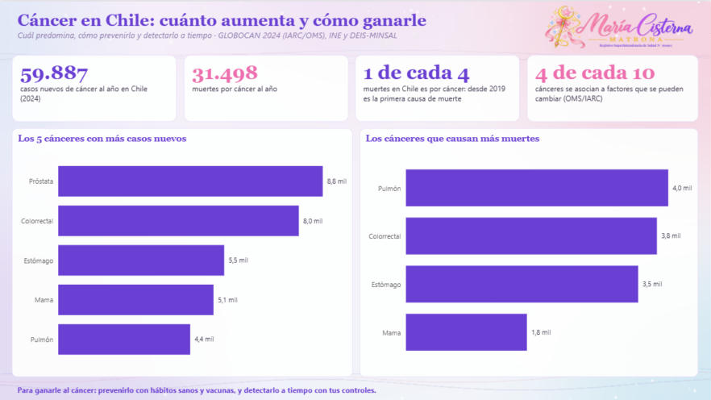</a>

 <a href="capturas/03_cual_predomina.png">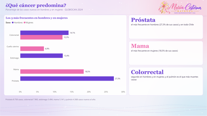</a>  <a href="capturas/05_chile_y_el_mundo.png">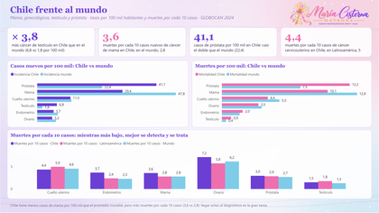</a> <a href="capturas/06_cancer_de_mama.png">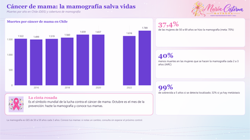</a> <a href="capturas/07_cuello_uterino.png">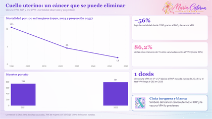</a> <a href="capturas/08_detectarlo_a_tiempo.png">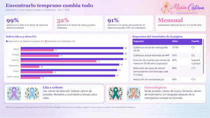</a> 

---

## ✨ ¿Qué muestra?

      

Cuántos casos y muertes por cáncer hay en Chile, cómo han aumentado, cuál predomina en hombres y en mujeres, cómo prevenir cada uno y qué examen lo detecta a tiempo, con las cintas de cada cáncer explicadas.

Cada página parte con sus **indicadores clave (KPI)** y una página final explica **qué mide cada KPI, cómo se calcula y por qué importa**. Power BI y Tableau tienen las mismas páginas.

---

## 📌 KPI que uso y por qué

| KPI | Valor en Chile | Cómo se calcula | Qué evalúa | Por qué importa | Meta o referencia |
|---|---|---|---|---|---|
| **Casos nuevos de cáncer al año** | 59.887 (2024) | Número de casos nuevos estimados en el año | Carga total de cáncer en Chile | Sirve para planificar oncólogos, quimioterapia, cirugías y camas | — |
| **Variación de muertes por cáncer** | +71% (2001–2024) | (Muertes 2024 − muertes 2001) ÷ muertes 2001 × 100 | Cuánto ha aumentado la mortalidad por cáncer | Se explica en parte por el envejecimiento: por eso importan la prevención y la detección precoz | — |
| **Proporción de muertes por cáncer** | 1 de cada 4 muertes (26%) | Muertes por cáncer ÷ total de defunciones × 100 | Peso del cáncer entre todas las causas de muerte | Desde 2019 es la primera causa de muerte en Chile | — |
| **Tasa de incidencia por 100 mil** | Mama: 29,4 | Casos nuevos ÷ población × 100.000 | Riesgo de que aparezca un cáncer en un año | Permite comparar Chile con el mundo y entre tipos de cáncer | Mundo, mama: 47,8 |
| **Tasa de mortalidad por 100 mil** | Mama: 10,1 | Muertes ÷ población × 100.000 | Riesgo de morir por ese cáncer en un año | Junto a la incidencia muestra cuán letal es cada cáncer | Mundo, mama: 12,9 |
| **Razón mortalidad / incidencia** | Mama: 3,6 muertes por cada 10 casos | Muertes ÷ casos nuevos × 10 | Cuántos mueren por cada 10 diagnosticados | Es un reflejo del acceso a diagnóstico precoz y tratamiento: más bajo es mejor | Mundo, mama: 2,8 |
| **Cobertura de mamografía vigente** | 37,4% (mujeres de 50 a 69) | Mujeres con mamografía al día ÷ mujeres de 50 a 69 × 100 | Qué parte de la población objetivo está tamizada | La mamografía cada 2 a 3 años reduce cerca de 40% las muertes en quienes se la hacen | 70% |
| **Cobertura de PAP vigente** | 43% (estimada) | Mujeres con PAP al día ÷ mujeres de 25 a 64 × 100 | Qué parte de la población objetivo está tamizada | El tamizaje cada 3 a 5 años reduce hasta 80% los casos de cáncer cervicouterino | OMS 2030: 70% tamizadas con test de alta calidad |
| **Cobertura de vacuna VPH** | 86,2% (niñas menores de 15) | Niñas vacunadas ÷ niñas de la cohorte × 100 | Protección contra el virus que causa el cáncer cervicouterino | Es la prevención primaria más eficaz; parte de la estrategia de eliminación de la OMS | 90% (OMS 90-70-90) |
| **Sobrevida a 5 años según etapa** | Mama: 99% localizado · 32% con metástasis | Personas vivas a 5 años del diagnóstico ÷ personas diagnosticadas × 100 | Probabilidad de seguir con vida 5 años después | Muestra el valor de detectar a tiempo: la etapa cambia todo | — |
| **Fracción atribuible a factores modificables** | 37,8% | Casos que se evitarían eliminando los factores de riesgo ÷ casos totales × 100 | Qué parte del cáncer se puede prevenir | Tabaco, alcohol, sedentarismo, obesidad e infecciones (VPH, hepatitis B, H. pylori) se pueden cambiar | — |

---

## 🧭 Páginas del tablero

| Vista | Página | Qué encuentras |
|:---:|---|---|
| <a href="capturas/01_resumen.png">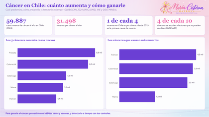</a> | 📊 **Resumen** | Casos y muertes por tipo de cáncer. |
|  | 📈 **¿Está aumentando?** | Muertes por año y proyección. |
|  | ⚖️ **¿Cuál predomina?** | Los más frecuentes en hombres y mujeres. |
|  | 🛡️ **Cómo prevenirlo** | Prevención y detección de cada cáncer. |
|  | 🌍 **Chile y el mundo** | Tasas y muertes por cada 10 casos. |
|  | 🌸 **Cáncer de mama** | Muertes y mamografía. |
|  | 💠 **Cuello uterino** | Vacuna VPH, PAP y mortalidad. |
|  | 🔎 **Detectarlo a tiempo** | Sobrevida según la etapa y exámenes. |
|  | 📐 **Qué mide cada KPI** | Fórmula, qué evalúa, por qué importa y meta. |
| | 📚 **Fuentes** | Referencias de cada cifra. |

---

## 📊 Vista del tablero en Power BI

### 📊 Resumen

Casos y muertes por tipo de cáncer.

### 📈 ¿Está aumentando?

Muertes por año y proyección.

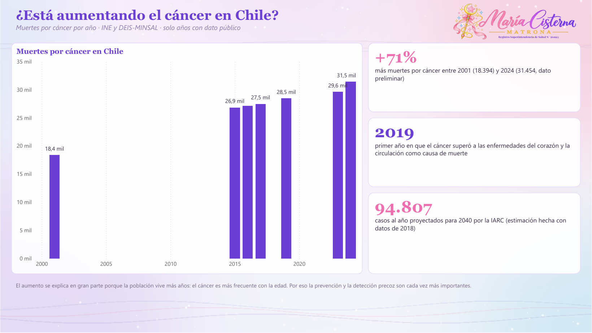

### ⚖️ ¿Cuál predomina?

Los más frecuentes en hombres y mujeres.

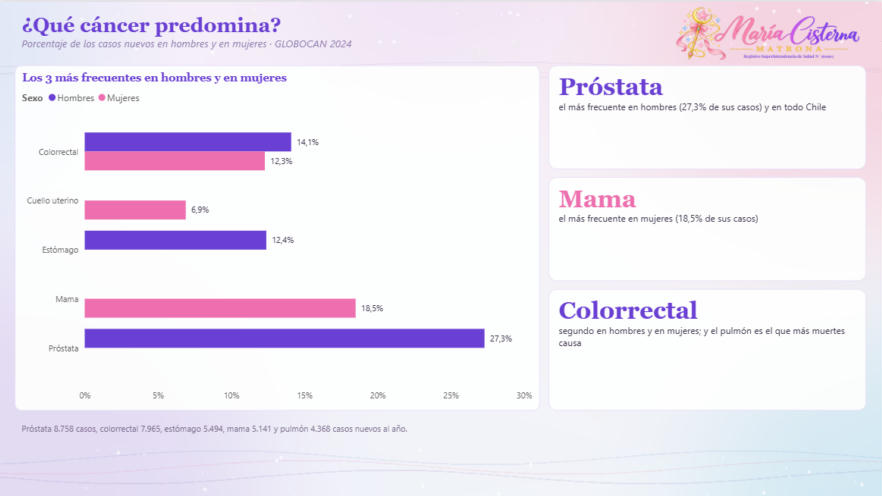

### 🛡️ Cómo prevenirlo

Prevención y detección de cada cáncer.

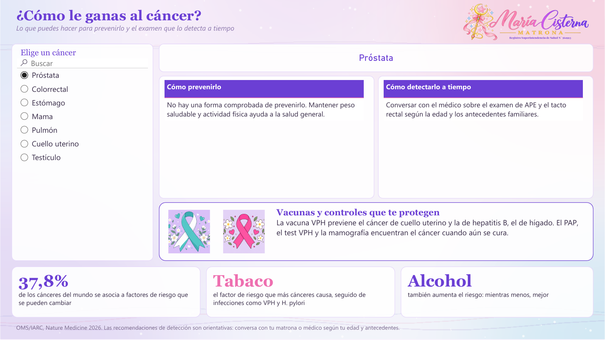

### 🌍 Chile y el mundo

Tasas y muertes por cada 10 casos.

### 🌸 Cáncer de mama

Muertes y mamografía.

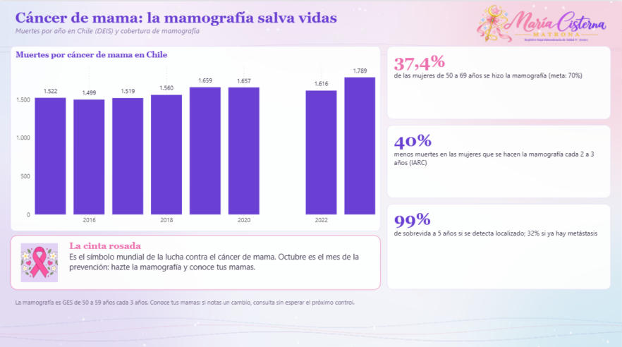

### 💠 Cuello uterino

Vacuna VPH, PAP y mortalidad.

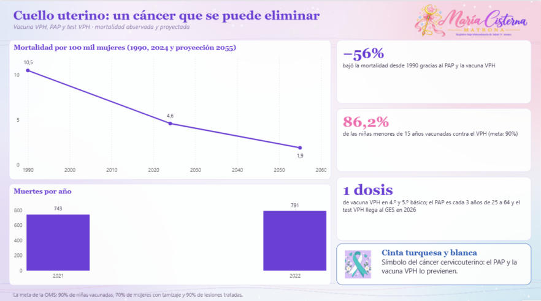

### 🔎 Detectarlo a tiempo

Sobrevida según la etapa y exámenes.

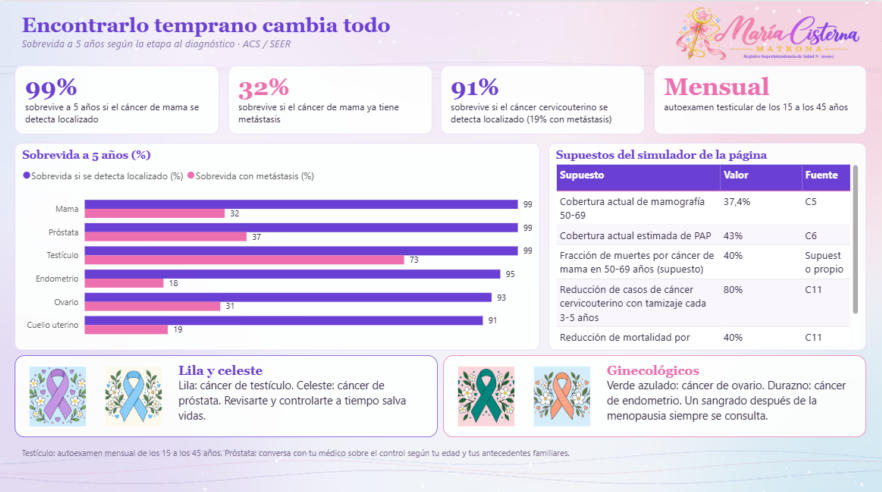

### 📐 Qué mide cada KPI

Fórmula, qué evalúa, por qué importa y meta.

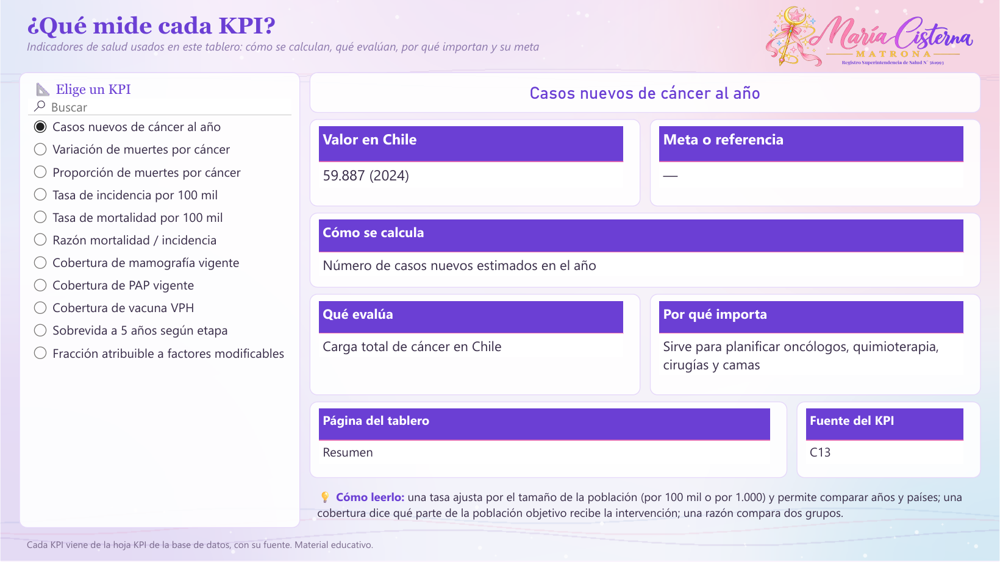

## 🎨 Vista del tablero en Tableau

El `.twbx` tiene las mismas páginas, con filtros, listas desplegables y controles deslizantes.

📊 <b>Resumen</b>

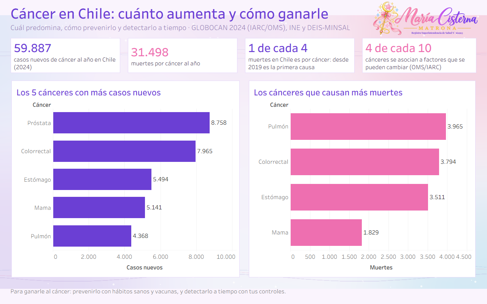

📈 <b>¿Está aumentando?</b>

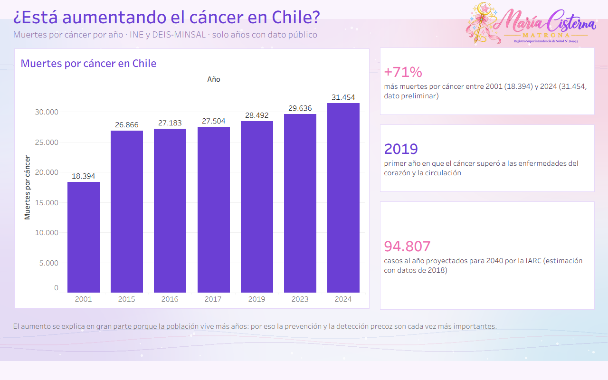

⚖️ <b>¿Cuál predomina?</b>

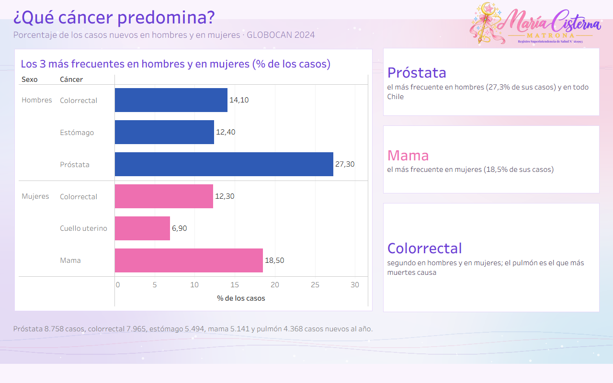

🛡️ <b>Cómo prevenirlo</b>

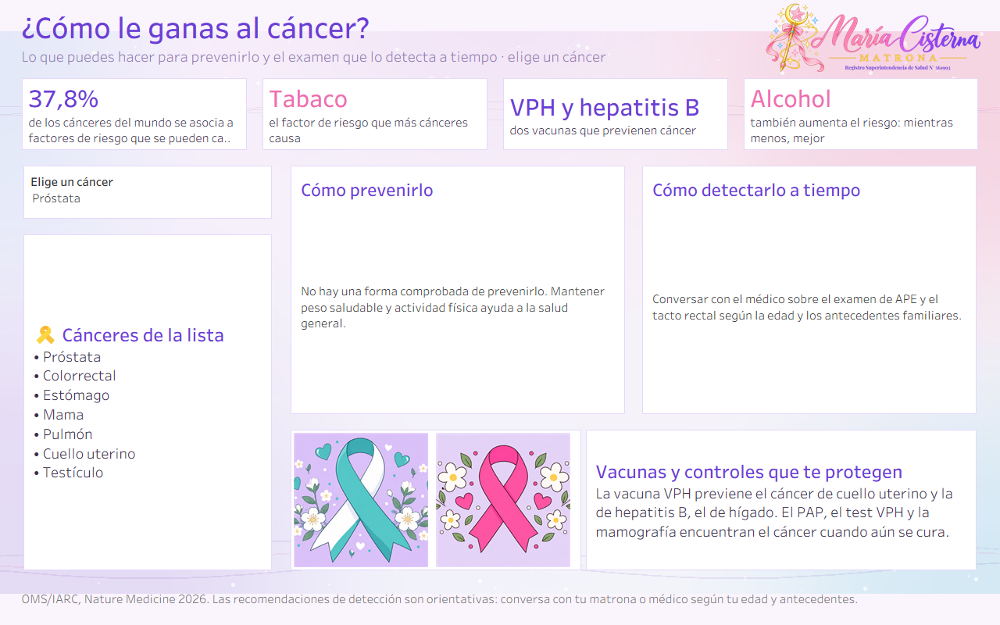

🌍 <b>Chile y el mundo</b>

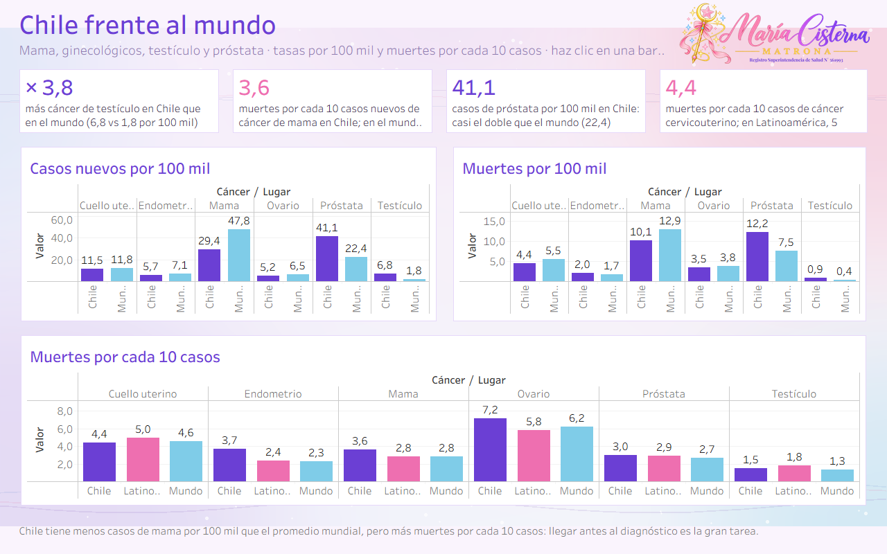

🌸 <b>Cáncer de mama</b>

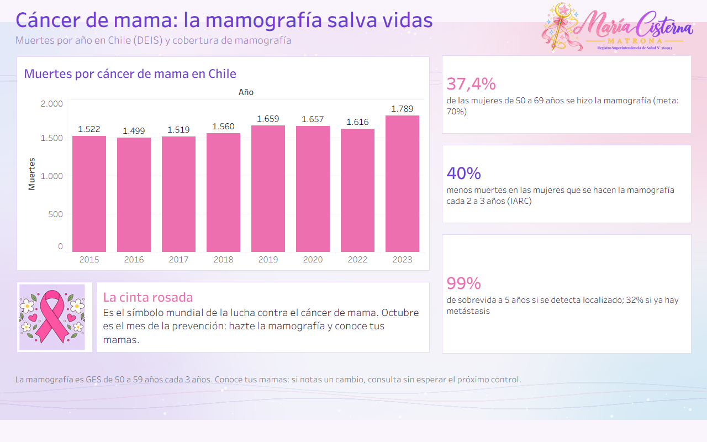

💠 <b>Cuello uterino</b>

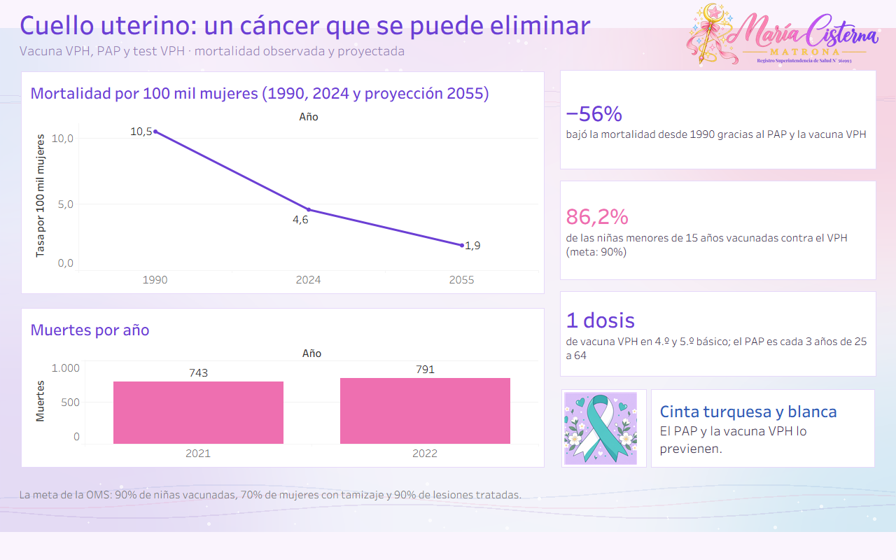

🔎 <b>Detectarlo a tiempo</b>

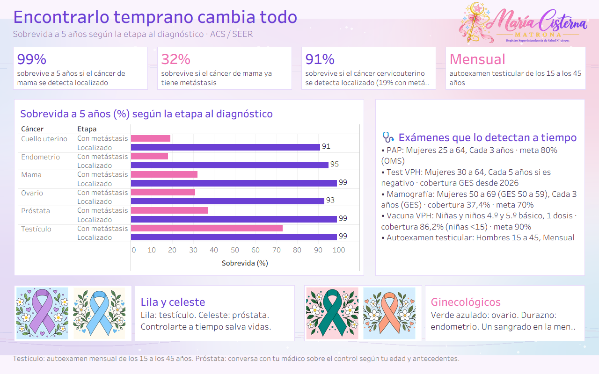

📐 <b>Qué mide cada KPI</b>

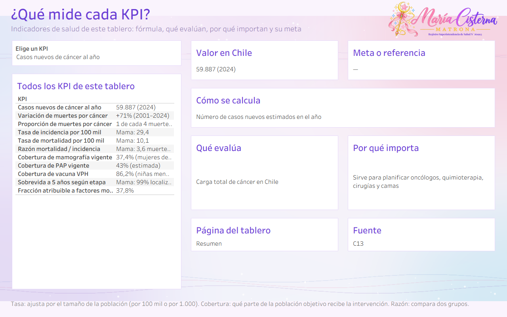

---

## 🎤 Presentación

La presentación [`Salud_Chile_en_datos_MariaCisterna.pptx`](../presentacion/Salud_Chile_en_datos_MariaCisterna.pptx) resume los cinco tableros: antes y ahora, Chile frente al mundo, métricas frente a sus metas, hallazgos, medidas y conclusiones.

---

## 📁 Archivos

| | Archivo | Qué es |
|:---:|---|---|
| 📊 | `Cancer_Chile_MariaCisterna.pbix` | Tablero de **Power BI**. Ábrelo con Power BI Desktop (gratis). |
| 🎨 | `Cancer_Chile_MariaCisterna.twbx` | Tablero de **Tableau**. Ábrelo con Tableau Public o Tableau Desktop. |
| 🧩 | `PowerBI_proyecto_pbip.zip` | **Proyecto editable** de Power BI (PBIP): descomprime y abre el `.pbip`. |
| 🗂️ | `Cancer_Chile_BaseDatos.xlsx` | **Base de datos** con todas las tablas, la hoja `KPI` y la hoja `Fuentes`. |
| 🖼️ | `capturas/` | Imágenes de cada página en Power BI y en Tableau, y miniaturas en `capturas/mini/`. |
| 🎀 | `recursos/` | Logo con registro y fondo usados en los tableros. |

---

## 🛠️ Cómo abrirlo

1. Descarga el repositorio: botón verde **Code → Download ZIP** y descomprímelo.
2. **Power BI:** abre `Cancer_Chile_MariaCisterna.pbix`. Para actualizar con tu copia del Excel: **Transformar datos → Administrar parámetros → RutaBaseDatos**, pega la ruta del `.xlsx` y aprieta **Actualizar**.
3. **Tableau:** abre `Cancer_Chile_MariaCisterna.twbx`; los datos ya vienen incluidos.

> 💡 **Tip:** las listas de la izquierda, los menús desplegables y los controles deslizantes son interactivos: elige una opción y el tablero cambia.

---

## 🗂️ Base de datos

`Cancer_Chile_BaseDatos.xlsx` trae estas hojas: `Globocan2024`, `MamaMuertes`, `CervixTasa`, `CervixMuertes`, `Pesquisa`, `KPI`, `KPILargo`, `ChileMundoLargo`, `SobrevidaLargo`, `Fuentes`, `ChileMundo`, `SobrevidaEtapa`, `SimuladorSupuestos`, `TopIncidencia`, `TopMortalidad`, `PorSexo`, `MuertesSerie`, `Prevencion`.

Cada fila indica su fuente en la columna `FuenteID`. Si un año no tiene dato público, queda vacío: **no se inventaron cifras**.

---

## 📚 Fuentes

- **C1** · GLOBOCAN 2024 (IARC/OMS, sept. 2026): Chile, Latinoamérica y el Caribe, Mundo — [enlace](https://gco.iarc.who.int/media/globocan/factsheets/populations/152-chile-fact-sheet.pdf)
- **C2** · MINSAL: reducción 56% mortalidad cáncer cervicouterino (2025) — [enlace](https://www.minsal.cl/ministra-aguilera-destaca-reduccion-del-56-en-mortalidad-por-cancer-cervicouterino-gracias-a-politicas-de-estado/)
- **C3** · BCN 2023: Cáncer de mama y mamografías en Chile — [enlace](https://obtienearchivo.bcn.cl/obtienearchivo?id=repositorio/10221/34431/1/202307_BCN_Cancer_de_mama_y_mamografias.pdf)
- **C4** · DEIS vía 24horas (16-10-2024) — [enlace](https://www.24horas.cl/tendencias/tecnologia-y-ciencias/muertes-por-cancer-de-mama-aumentan-un-12-87-en-chile)
- **C5** · Observatorio del Cáncer vía La Tercera (21-10-2025) — [enlace](https://www.latercera.com/nacional/noticia/observatorio-del-cancer-revela-cifras-decidoras-solo-4-de-cada-10-mujeres-de-50-a-69-anos-tienen-su-mamografia-al-dia/)
- **C6** · DEIS vía Vergara 240 UDP — [enlace](https://vergara240.udp.cl/chile-790-muertes-anuales-cancer-cervicouterino/)
- **C7** · MINSAL Guía GES Cáncer de testículo — [enlace](https://diprece.minsal.cl/le-informamos/auge/acceso-guias-clinicas/guias-clinicas-desarrolladas-utilizando-manual-metodologico/cancer-de-testiculos-en-personas-de-15-anos-y-mas/descripcion-y-epidemiologia/)
- **C11** · IARC Handbooks vol. 15 (2016) y vol. 10 (2005): tamizaje de mama y cervicouterino — [enlace](https://publications.iarc.who.int/)
- **C12** · American Cancer Society / SEER: sobrevida a 5 años por etapa — [enlace](https://www.cancer.org/research/cancer-facts-statistics.html)
- **C13** · GLOBOCAN 2024 vía Observatorio del Cáncer: Radiografía del cáncer en Chile — [enlace](https://www.observatoriodelcancer.cl/post/radiograf%C3%ADa-del-c%C3%A1ncer-en-chile-qu%C3%A9-revelan-las-cifras-de-globocan-2024)
- **C14** · INE Estadísticas Vitales 2019 vía La Tercera: el cáncer es por primera vez la principal causa de muerte — [enlace](https://www.latercera.com/la-tercera-sabado/noticia/cancer-es-por-primera-vez-la-principal-causa-de-muerte-en-chile/KIPWS6M5HNHMJCE27GVGYJS52U/)
- **C15** · INE: 25,9% de las muertes en 2017 se produjo por tumores — [enlace](https://www.ine.gob.cl/sala-de-prensa/prensa/general/noticia/2020/02/04/c%C3%A1ncer-en-chile-25-9-de-las-muertes-en-2017-se-produjo-por-tumores)
- **C16** · DEIS-MINSAL vía El Mercurio y GesNova Salud: defunciones por tumores 2023 y 2024 (preliminar) — [enlace](https://gesnovasalud.com/en-2024-se-agudizo-el-alza-de-muertes-por-cancer-y-patologias-del-sistema-circulatorio/)
- **C17** · OMS/IARC, Nature Medicine 2026: 37,8% de los cánceres se asocia a factores de riesgo modificables — [enlace](https://www.24horas.cl/conciencia-24-7/ciencia/oms-cuatro-diez-canceres-podrian-prevenirse)
- **C18** · IARC (GLOBOCAN 2018) vía AFP/24horas: proyección de casos y muertes en Chile a 2040 — [enlace](https://www.24horas.cl/tendencias/salud-bienestar/las-preocupantes-cifras-del-aumento-de-cancer-en-chile-3048324)

---

## ⚠️ Aviso

Material educativo y de análisis de datos. **No reemplaza la consejería ni el control con un profesional de salud.**

## ©️ Derechos

© 2026 María Cisterna Escobar, matrona. Todos los derechos reservados: puedes ver y compartir el enlace, pero no copiar ni reutilizar el contenido sin autorización. Ver `LICENSE`.
