

<h1 align="center">🤰 Embarazo no planificado y matronería en Chile</h1>

<b>María Cisterna Escobar · Matrona</b> — Registro Superintendencia de Salud N° 561993

<a href="capturas/01_resumen.png">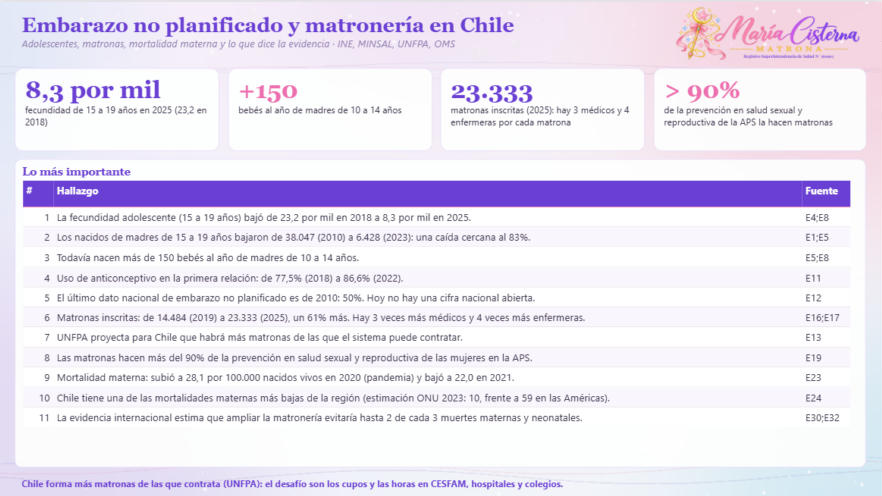</a>

<a href="capturas/02_embarazo_adolescente.png">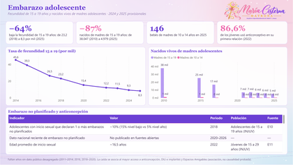</a>  <a href="capturas/04_mortalidad_materna_y_neonatal.png">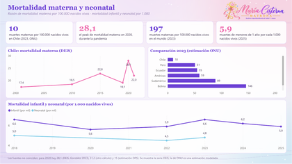</a> <a href="capturas/05_lo_que_dice_la_evidencia.png">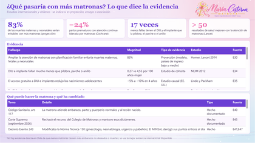</a> <a href="capturas/06_propuestas.png">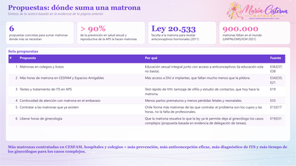</a> <a href="capturas/07_simulador_matronas_en_colegios.png">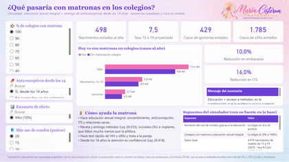</a> 

---

## ✨ ¿Qué muestra?

Embarazo adolescente, matronas en Chile, mortalidad materna y neonatal, lo que dice la evidencia sobre más matronas, propuestas y un **simulador** de educación sexual integral con matronas en los colegios y entrega de anticonceptivos desde los 14 años.

Cada página parte con sus **indicadores clave (KPI)** y una página final explica **qué mide cada KPI, cómo se calcula y por qué importa**. Power BI y Tableau tienen las mismas páginas.

---

## 🔍 Qué investigué

Usé estadísticas vitales del INE y DEIS, el Registro Nacional de Prestadores de la Superintendencia de Salud, estimaciones de ONU/OMS de mortalidad materna y la evidencia Cochrane sobre la continuidad de atención por matronas.

## 💡 Lo que observé

- 👧 La fecundidad de 15 a 19 años bajó de 23,2 a 8,3 por mil entre 2018 y 2025: cayó a un tercio.
- ⚠️ Aún nacen 146 guaguas al año de madres de 10 a 14 años: todo embarazo a esa edad debe investigarse.
- 🩺 Las matronas inscritas crecieron de 13.723 a 23.333 (+70%) entre 2018 y 2025.
- ❤️ La mortalidad materna de Chile (10 por 100 mil nacidos vivos) es de las más bajas de la región.
- 📭 El último dato nacional de embarazo no planificado es de 2010.

## 🎯 Lo que concluyo

> La prevención funciona y Chile tiene más matronas que nunca: el desafío es ponerlas donde está la prevención, como los colegios, y volver a medir el embarazo no planificado.

---

## 📌 KPI que uso y por qué

| KPI | Valor en Chile | Cómo se calcula | Qué evalúa | Por qué importa | Meta o referencia |
|---|---|---|---|---|---|
| **Tasa específica de fecundidad de 15 a 19 años** | 8,3 por 1.000 (2025) | Nacidos vivos de madres de 15 a 19 ÷ mujeres de 15 a 19 × 1.000 | Cuántos nacimientos hay por cada 1.000 adolescentes | Indicador ODS 3.7.2; refleja acceso a educación sexual y anticoncepción | Seguir bajando (23,2 en 2018) |
| **Nacidos vivos de madres de 10 a 14 años** | 146 (2025) | Número de nacidos vivos de madres de 10 a 14 años en el año | Embarazos en niñas | Todo embarazo bajo 14 años es una alerta de protección y posible abuso | Cero |
| **Uso de anticonceptivo en la primera relación** | 86,6% (2022) | Jóvenes que usaron algún método en su inicio sexual ÷ jóvenes con inicio sexual × 100 | Protección desde la primera relación | Es el momento de mayor riesgo de embarazo no planificado e ITS | Acercarse al 100% |
| **Necesidad insatisfecha de planificación familiar** | 6% (2019) | Mujeres que no quieren embarazarse y no usan método ÷ mujeres en edad fértil × 100 | Brecha entre el deseo de no embarazarse y el acceso a un método | Relacionado con el ODS 3.7.1: mide el acceso real a anticoncepción | Lo más bajo posible |
| **Densidad de matronas** | 8,7 por 10.000 habitantes (2022) | Matronas inscritas ÷ población × 10.000 | Disponibilidad de matronas para la población | La OMS usa la densidad de personal de salud para estimar si alcanza para cubrir la atención | — |
| **Crecimiento de matronas inscritas** | +61% (2019–2025) | (Inscritas 2025 − inscritas 2019) ÷ inscritas 2019 × 100 | Cuánto crece la fuerza de trabajo | Chile forma más matronas de las que contrata: el desafío son los cupos | — |
| **Razón de mortalidad materna (RMM)** | 10 por 100.000 nacidos vivos (ONU 2023) | Muertes maternas ÷ nacidos vivos × 100.000 | Riesgo de morir por causas del embarazo, parto o puerperio | Indicador ODS 3.1.1: refleja acceso y calidad de la atención materna | ODS: < 70 (mundo); Chile ya la cumple |
| **Tasa de mortalidad infantil** | 5,9 por 1.000 nacidos vivos (2025) | Defunciones de menores de 1 año ÷ nacidos vivos × 1.000 | Riesgo de morir antes del primer año | Es uno de los mejores reflejos del nivel de salud de un país | Mantener bajo 7 |
| **Tasa de mortalidad neonatal** | 4,8 por 1.000 nacidos vivos (2023) | Defunciones de 0 a 27 días ÷ nacidos vivos × 1.000 | Riesgo de morir en el primer mes | Indicador ODS 3.2.2: depende del control prenatal, el parto y la atención del recién nacido | ODS: ≤ 12 |
| **Riesgo relativo de parto prematuro con continuidad de matrona** | RR 0,76 (−24%) | Riesgo en el grupo con continuidad de matrona ÷ riesgo en el grupo con atención habitual | Cuánto cambia el riesgo con el modelo de matronas | Un RR menor que 1 indica protección; viene de ensayos clínicos (Cochrane) | — |

---

## 🏫 Simulador: ¿qué pasaría con matronas en los colegios?

Página interactiva, en Power BI y en Tableau, para explorar escenarios de prevención:

- 🏫 **% de colegios con matrona:** qué parte de los colegios tendría una matrona haciendo educación sexual integral.
- 💊 **Anticonceptivos desde los 14 años:** si además se entregan métodos (la Ley 20.418 garantiza información y acceso; desde los 14 años la atención es confidencial).
- 📊 **Escenario de efecto:** 5% (conservador) o 10% (alto) menos nacimientos adolescentes, según la evidencia de acceso gratuito a DIU e implantes.
- 🛡️ **Más uso de condón:** cuántos puntos sube el uso de condón gracias a la educación; el condón usado siempre reduce cerca de 80% la transmisión del VIH.

El tablero calcula los **nacimientos adolescentes evitados**, la **tasa de 15 a 19 años proyectada** y los **casos de gonorrea y sífilis evitados**, y explica cómo ayuda la matrona: educación sexual integral, receta de DIU, implante y otros métodos (Ley 20.533), test rápido de VIH y sífilis y atención confidencial.

 

> ⚠️ Es una **simulación educativa con supuestos explícitos**, no una proyección oficial. La educación sola, sin acceso a métodos, no mostró un efecto claro en embarazos (Cochrane 2016): por eso el simulador separa los dos efectos.

---

## 🧭 Páginas del tablero

| Vista | Página | Qué encuentras |
|:---:|---|---|
|  | 📊 **Resumen** | Indicadores clave y hallazgos. |
|  | 👧 **Embarazo adolescente** | Fecundidad de 15 a 19 años y nacidos de madres adolescentes. |
|  | 🩺 **Matronas en Chile** | Inscritas por año y comparación con otras profesiones. |
|  | ❤️ **Mortalidad materna y neonatal** | Chile, la región y el mundo. |
|  | 🔬 **Lo que dice la evidencia** | Estudios y competencias de la matrona. |
|  | 💡 **Propuestas** | Dónde suma una matrona. |
|  | 🏫 **Simulador: matronas en colegios** | Educación + anticonceptivos desde los 14 años. |
|  | 📐 **Qué mide cada KPI** | Fórmula, qué evalúa, por qué importa y meta. |
| | 📚 **Fuentes** | Referencias de cada cifra. |

---

## 📊 Vista del tablero en Power BI

### 📊 Resumen

Indicadores clave y hallazgos.

### 👧 Embarazo adolescente

Fecundidad de 15 a 19 años y nacidos de madres adolescentes.

### 🩺 Matronas en Chile

Inscritas por año y comparación con otras profesiones.

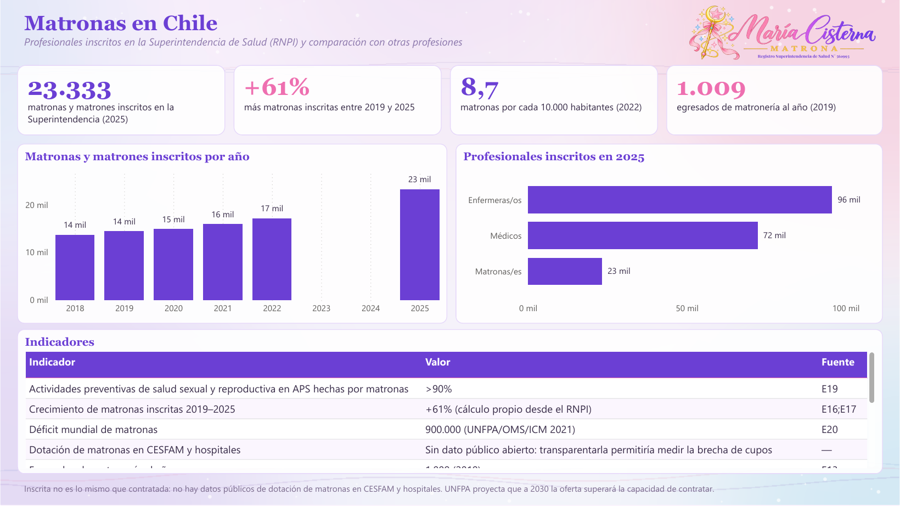

### ❤️ Mortalidad materna y neonatal

Chile, la región y el mundo.

### 🔬 Lo que dice la evidencia

Estudios y competencias de la matrona.

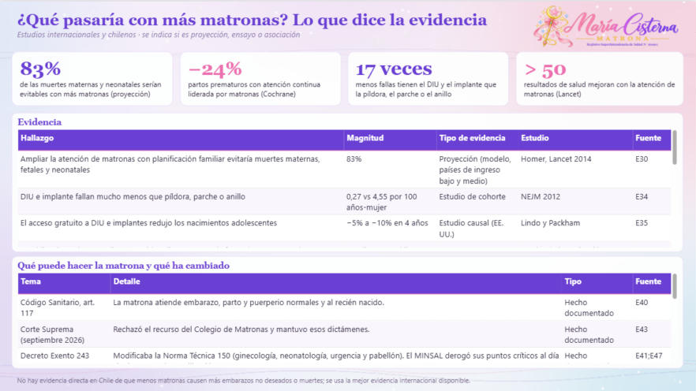

### 💡 Propuestas

Dónde suma una matrona.

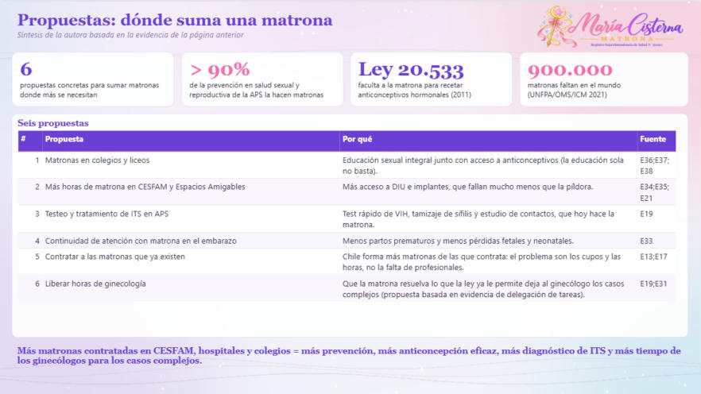

### 🏫 Simulador: matronas en colegios

Educación + anticonceptivos desde los 14 años.

### 📐 Qué mide cada KPI

Fórmula, qué evalúa, por qué importa y meta.

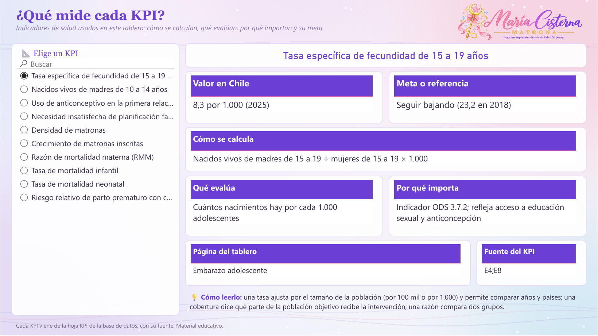

## 🎨 Vista del tablero en Tableau

El `.twbx` tiene las mismas páginas, con filtros, listas desplegables y controles deslizantes.

📊 <b>Resumen</b>

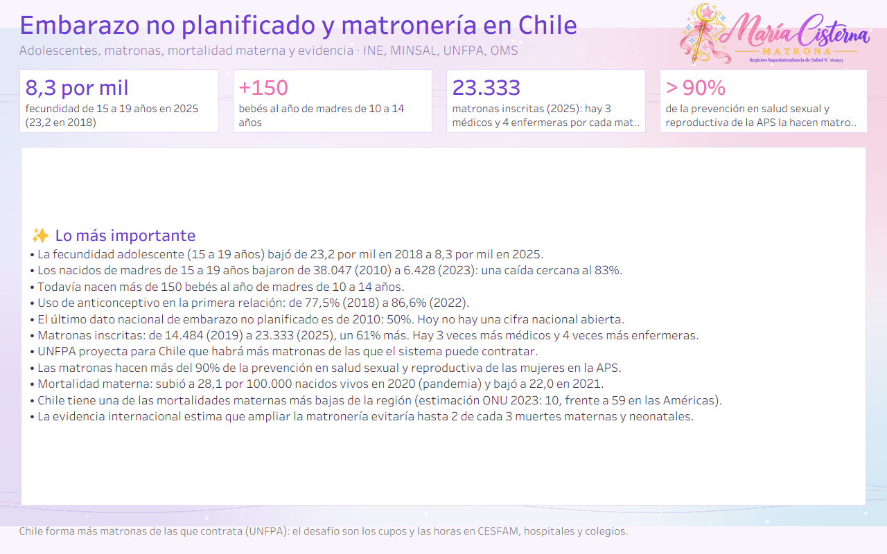

👧 <b>Embarazo adolescente</b>

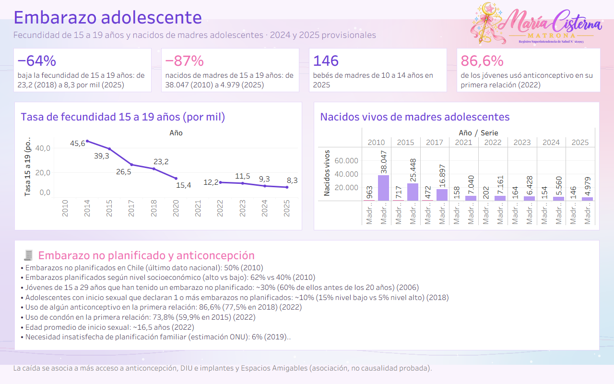

🩺 <b>Matronas en Chile</b>

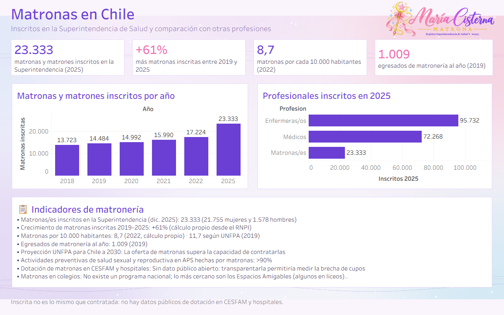

❤️ <b>Mortalidad materna y neonatal</b>

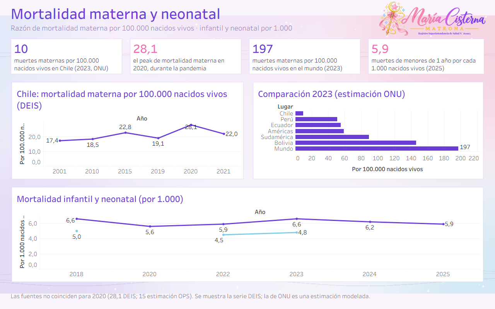

🔬 <b>Lo que dice la evidencia</b>

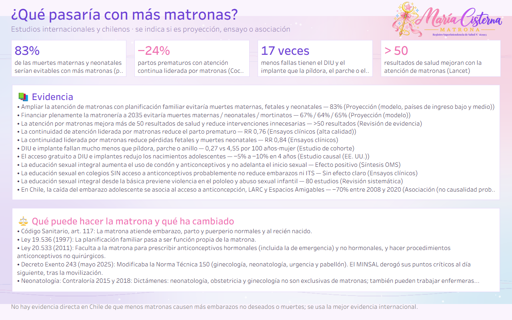

💡 <b>Propuestas</b>

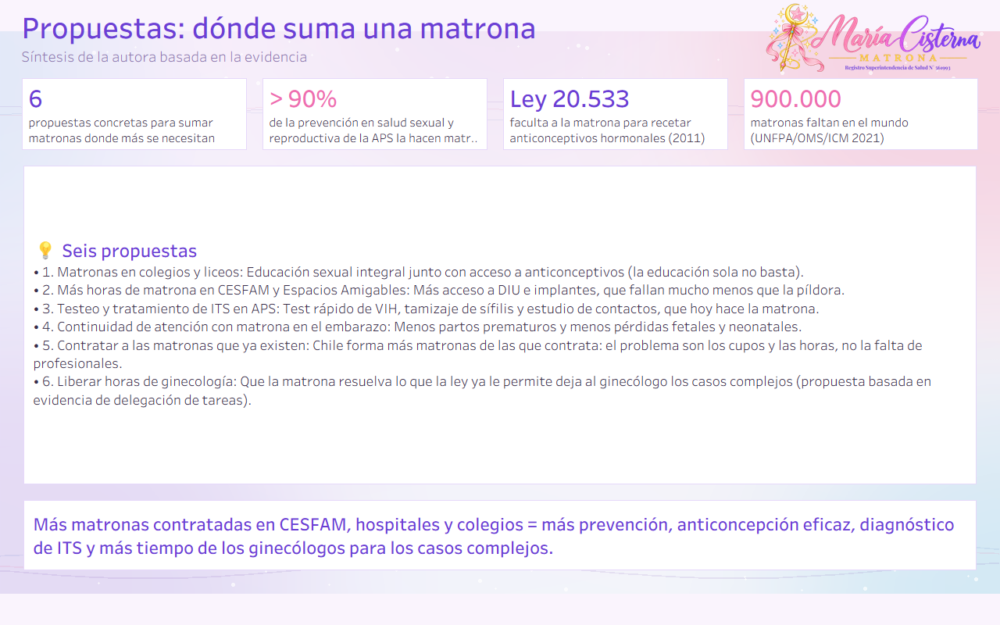

🏫 <b>Simulador: matronas en colegios</b>

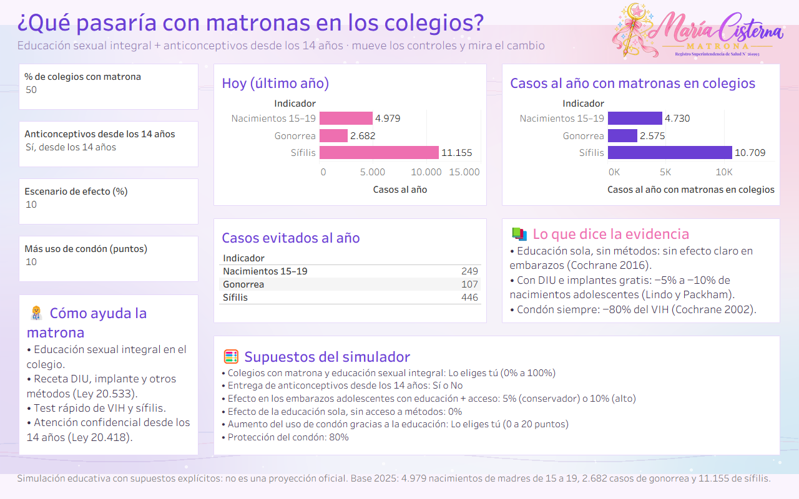

📐 <b>Qué mide cada KPI</b>

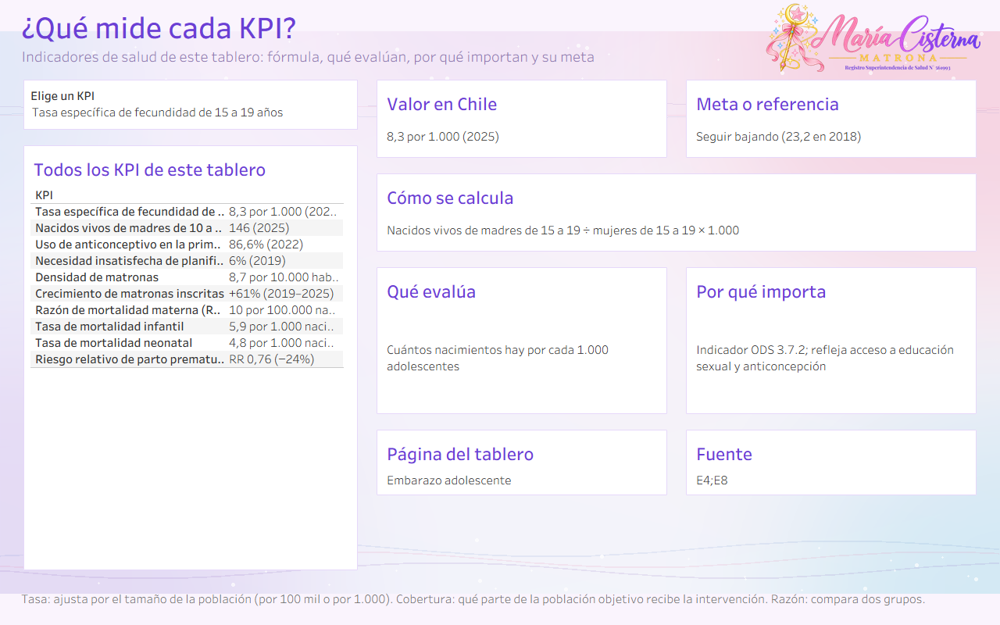

---

## 🎤 Presentación

La presentación [`Salud_Chile_en_datos_MariaCisterna.pptx`](../presentacion/Salud_Chile_en_datos_MariaCisterna.pptx) resume los cinco tableros: antes y ahora, Chile frente al mundo, métricas frente a sus metas, hallazgos, medidas y conclusiones.

---

## 📁 Archivos

| | Archivo | Qué es |
|:---:|---|---|
| 📊 | `Embarazo_Matronas_MariaCisterna.pbix` | Tablero de **Power BI**. Ábrelo con Power BI Desktop (gratis). |
| 🎨 | `Embarazo_Matronas_MariaCisterna.twbx` | Tablero de **Tableau**. Ábrelo con Tableau Public o Tableau Desktop. |
| 🧩 | `PowerBI_proyecto_pbip.zip` | **Proyecto editable** de Power BI (PBIP): descomprime y abre el `.pbip`. |
| 🗂️ | `Embarazo_Matronas_BaseDatos.xlsx` | **Base de datos** con todas las tablas, la hoja `KPI` y la hoja `Fuentes`. |
| 🖼️ | `capturas/` | Imágenes de cada página en Power BI y en Tableau, y miniaturas en `capturas/mini/`. |
| 🎀 | `recursos/` | Logo con registro y fondo usados en los tableros. |

---

## 🛠️ Cómo abrirlo

1. Descarga el repositorio: botón verde **Code → Download ZIP** y descomprímelo.
2. **Power BI:** abre `Embarazo_Matronas_MariaCisterna.pbix`. Para actualizar con tu copia del Excel: **Transformar datos → Administrar parámetros → RutaBaseDatos**, pega la ruta del `.xlsx` y aprieta **Actualizar**.
3. **Tableau:** abre `Embarazo_Matronas_MariaCisterna.twbx`; los datos ya vienen incluidos.

> 💡 **Tip:** las listas de la izquierda, los menús desplegables y los controles deslizantes son interactivos: elige una opción y el tablero cambia.

---

## 🗂️ Base de datos

`Embarazo_Matronas_BaseDatos.xlsx` trae estas hojas: `Adolescentes`, `NoPlanificado`, `MatronasSerie`, `Profesiones`, `MatronasIndicadores`, `MortalidadMaterna`, `MaternaComparacion`, `MortalidadInfantil`, `Evidencia`, `Competencias`, `Propuestas`, `Hallazgos`, `AdolLargo`, `InfantilLargo`, `KPI`, `KPILargo`, `SimColegios`, `SimAcceso`, `SimEfecto`, `SimCondon`, `SimIndicadores`, `SimSupuestos`, `Fuentes`.

Cada fila indica su fuente en la columna `FuenteID`. Si un año no tiene dato público, queda vacío: **no se inventaron cifras**.

---

## 📚 Fuentes

- **E1** · MINSAL, Actualización de la situación de salud de adolescentes (2021). — [enlace](https://diprece.minsal.cl/wp-content/uploads/2021/06/ACTUALIZACION-SITUACION-DE-SALUD-DE-ADOLESCENTES-PROGRAMA-NACIONAL-DE-SALUD-INTEGRAL-DE-ADOLESCENTES-Y-JOVENES.pdf)
- **E2** · INE, Enfoque estadístico maternidad y paternidad (2017). — [enlace](https://www.ine.gob.cl/docs/default-source/genero/documentos-de-an%C3%A1lisis/documentos/enfoque-maternidad-paternidad-2017.pdf)
- **E3** · INE vía Emol, cifras de maternidad en Chile (2020). — [enlace](https://www.emol.com/noticias/Economia/2020/05/09/985650/Cifras-maternidad-en-Chile.html)
- **E4** · INE, nacimientos 2018 (nota de prensa, 2021). — [enlace](https://www.ine.gob.cl/sala-de-prensa/prensa/general/noticia/2021/01/11/nacimientos-de-madres-extranjeras-crecen-y-alcanzan-el-14-en-chile)
- **E5** · La Tercera, embarazo adolescente en su cifra más baja (2024). — [enlace](https://www.latercera.com/que-pasa/noticia/uso-de-anticonceptivos-llevan-al-embarazo-adolescente-a-la-cifra-mas-baja-desde-que-hay-registros/H5QUT6YRKNH2VDXD7LV6BPYH7Y/)
- **E6** · INE, Estadísticas vitales: fecundidad en Chile (17-03-2025). — [enlace](https://www.ine.gob.cl/sala-de-prensa/prensa/general/noticia/2025/03/17/estad%C3%ADsticas-vitales-fecundidad-en-chile-sigue-bajo-del-nivel-de-reemplazo-generacional)
- **E7** · INE, Estadísticas vitales cifras provisionales 2024. — [enlace](https://www.ine.gob.cl/docs/default-source/nacimientos-matrimonios-y-defunciones/publicaciones-y-anuarios/anuarios-de-estad%C3%ADsticas-vitales/estad%C3%ADsticas-vitales-cifras-provisionales-2024.pdf)
- **E8** · INE, Estadísticas vitales cifras provisionales 2025. — [enlace](https://www.ine.gob.cl/docs/default-source/nacimientos-matrimonios-y-defunciones/publicaciones-y-anuarios/anuarios-de-estad%C3%ADsticas-vitales/estad%C3%ADsticas-vitales-cifras-provisionales-2025.pdf)
- **E9** · Intramed: caída del embarazo adolescente en Chile (Rodríguez Vignoli, CEPAL). — [enlace](https://www.intramed.net/content/67057bde57fbbb5669b34e22)
- **E10** · CEPAL, Rodríguez Vignoli: fecundidad adolescente en Chile (datos INJUV 2018). — [enlace](https://repositorio.cepal.org/server/api/core/bitstreams/6dd4f6c2-3ace-4da3-a9de-b36f1be56c9f/content)
- **E11** · La Tercera Paula: 10.ª Encuesta Nacional de Juventudes INJUV 2022. — [enlace](https://www.latercera.com/paula/mas-tarde-y-las-mujeres-primero-radiografia-al-sexo-adolescente/)
- **E12** · La Tercera: 50% de los embarazos en Chile no son planificados (encuesta 2010). — [enlace](https://www.latercera.com/noticia/50-de-los-embarazos-en-chile-no-son-planificados/)
- **E13** · UNFPA, State of the World's Midwifery 2021: perfil de Chile. — [enlace](https://www.unfpa.org/sites/default/files/sowmy21/en/sowmy-2021-profile-cl.pdf)
- **E14** · Guttmacher, embarazo no planeado en América Latina y el Caribe (2022). — [enlace](https://www.guttmacher.org/es/infographic/2022/la-tasa-de-embarazo-no-planeado-en-america-latina-y-el-caribe-es-de-69-por-cada)
- **E15** · UNFPA, casi la mitad de los embarazos no son intencionales (SWOP 2022). — [enlace](https://www.unfpa.org/press/nearly-half-all-pregnancies-are-unintended%E2%80%94-global-crisis-says-new-unfpa-report)
- **E16** · MINSAL, Glosa 01 letra d: profesionales inscritos en el RNPI (informe 2023). — [enlace](https://www.minsal.cl/wp-content/uploads/2021/05/Glosa-01-d-Ano-2023.pdf)
- **E17** · MINSAL, Glosa 01 letra d (informe 2026, datos a diciembre de 2025). — [enlace](https://www.minsal.cl/wp-content/uploads/2026/07/Glosa-01-letra-d-comun-a-los-capitulos-inciso-04.pdf)
- **E18** · Clínicas de Chile, Dimensionamiento del sector salud 2022. — [enlace](https://www.clinicasdechile.cl/wp-content/uploads/2023/12/Dimensionamiento-Completo-2022.pdf)
- **E19** · MINSAL, Normas Nacionales sobre Regulación de la Fertilidad (2018). — [enlace](https://www.minsal.cl/wp-content/uploads/2015/09/2018.01.30_NORMAS-REGULACION-DE-LA-FERTILIDAD.pdf)
- **E20** · UNFPA/OMS/ICM, State of the World's Midwifery 2021. — [enlace](https://unfpa.org/state-worlds-midwifery-2021)
- **E21** · MINSAL, Espacios Amigables en Ñuble (2025). — [enlace](https://www.minsal.cl/espacios-amigables-se-refuerza-red-de-apoyo-en-salud-para-adolescentes-en-nuble/)
- **E22** · Mortalidad materna Chile 2001–2021 (póster congreso UFRO 2023, datos DEIS). — [enlace](https://congreso2023.ufro.cl/images/presentaciones/e-poster/viernes/pantalla7/07-797-Tendencias%20de%20Mortalidad%20Materna.pdf)
- **E23** · González et al., Rev Méd Clín Las Condes 2023: mortalidad materna y prematuridad en pandemia (datos DEIS). — [enlace](https://www.elsevier.es/es-revista-revista-medica-clinica-las-condes-202-articulo-aumento-mortalidad-materna-prematuridad-durante-S0716864023000111)
- **E24** · ORAS-CONHU, Sala situacional de mortalidad materna (estimaciones ONU 2023). — [enlace](https://www.orasconhu.org/sites/default/files/file/webfiles/doc/Sala%20Situacional%2014-04-2025%20Mortalidad%20Materna.pdf)
- **E25** · OMS, nota descriptiva de mortalidad materna. — [enlace](https://www.who.int/news-room/fact-sheets/detail/maternal-mortality)
- **E26** · INE, Anuario de estadísticas vitales 2018 (síntesis). — [enlace](https://www.ine.gob.cl/docs/default-source/nacimientos-matrimonios-y-defunciones/publicaciones-y-anuarios/s%C3%ADntesis-anuarios-de-estad%C3%ADsticas-vitales/anuario-de-estad%C3%ADsticas-vitales-2018-s%C3%ADntesis.pdf)
- **E27** · INE, Anuario de estadísticas vitales 2022. — [enlace](https://www.ine.gob.cl/docs/default-source/nacimientos-matrimonios-y-defunciones/publicaciones-y-anuarios/anuarios-de-estad%C3%ADsticas-vitales/anuario-de-estad%C3%ADsticas-vitales-2022.pdf)
- **E28** · INE, Anuario de estadísticas vitales 2023. — [enlace](https://www.ine.gob.cl/docs/default-source/nacimientos-matrimonios-y-defunciones/publicaciones-y-anuarios/anuarios-de-estad%C3%ADsticas-vitales/anuario-de-estad%C3%ADsticas-vitales-2023-nacimientos-y-defunciones.pdf)
- **E29** · OPS, perfil de país Chile (indicadores). — [enlace](https://hia.paho.org/en/node/163)
- **E30** · Homer et al., Lancet 2014 (Serie Midwifery): efecto proyectado de ampliar la matronería. — [enlace](https://portaldeboaspraticas.iff.fiocruz.br/biblioteca/the-projected-effect-of-scaling-up-midwifery/)
- **E31** · Renfrew et al., Lancet 2014: matronería y calidad de la atención. — [enlace](https://portaldeboaspraticas.iff.fiocruz.br/biblioteca/midwifery-and-quality-care-findings-from-a-new-evidence-informed-framework-for-maternal-and-newborn-care/)
- **E32** · ICM: State of the World's Midwifery 2021. — [enlace](https://internationalmidwives.org/?p=2406)
- **E33** · Sandall et al., Cochrane 2016: modelos de continuidad liderados por matronas. — [enlace](https://portaldeboaspraticas.iff.fiocruz.br/biblioteca/midwife-led-continuity-models-versus-other-models-of-care-for-childbearing-women/)
- **E34** · Winner et al., NEJM 2012 (Proyecto CHOICE): eficacia de LARC. — [enlace](https://read.qxmd.com/read/22621627/effectiveness-of-long-acting-reversible-contraception)
- **E35** · Lindo y Packham (UC Davis): acceso a LARC y nacimientos adolescentes en Colorado. — [enlace](https://www.poverty.ucdavis.edu/sites/main/files/file-attachments/cpr-lindo_contraceptive_brief.pdf)
- **E36** · OMS, nota descriptiva: educación sexual integral (2026). — [enlace](https://www.who.int/news-room/fact-sheets/detail/comprehensive-sexuality-education)
- **E37** · Mason-Jones et al., Cochrane 2016: educación sexual escolar y prevención de VIH, ITS y embarazo. — [enlace](https://www.cochranelibrary.com/cdsr/doi/10.1002/14651858.CD006417.pub3/full)
- **E38** · Goldfarb y Lieberman, J Adolesc Health 2021: tres décadas de investigación en educación sexual integral. — [enlace](https://healtheducationresources.unesco.org/library/documents/three-decades-research-case-comprehensive-sex-education)
- **E39** · INJUV, Estudios vol. 12: embarazo adolescente (2020). — [enlace](https://www.injuv.gob.cl/sites/default/files/estudioembarazo.pdf)
- **E40** · Código Sanitario, artículo 117. — [enlace](https://iura.cl/csan/117)
- **E41** · T13: MINSAL deroga puntos del Decreto 243 tras reunión con el Colegio de Matronas (23-05-2025). — [enlace](https://www.t13.cl/noticia/nacional/minsal-deroga-controvertido-decreto-tras-reunion-colegio-matronas-matrones-23-5-2025)
- **E42** · Pauta: dictamen de Contraloría sobre neonatología (2018). — [enlace](https://www.pauta.cl/actualidad/2018/09/23/la-batalla-entre-matronas-y-enfermeras-por-un-dictamen-de-contraloria.html)
- **E43** · DOE: Corte Suprema mantiene dictámenes sobre funciones de matronas en neonatología (2026). — [enlace](https://actualidadjuridica.doe.cl/corte-suprema-mantiene-dictamenes-sobre-funciones-de-matronas-en-neonatologia/)
- **E44** · Cámara de Diputados: Comisión de Salud incluye atención de infertilidad en funciones de matronas (20-08-2026). — [enlace](https://www.camara.cl/cms/2026/08/20/comision-de-salud-incluye-en-funciones-de-matronas-atencion-de-infertilidad/)
- **E45** · BioBioChile: urgencia al proyecto de educación sexual integral (07-01-2026). — [enlace](https://www.biobiochile.cl/noticias/nacional/chile/2026/01/07/gobierno-pone-urgencia-a-proyecto-de-educacion-sexual-integral-oposicion-acusa-agenda-ideologica.shtml)
- **E46** · Colegio de Matronas: movilización revierte puntos críticos del Decreto 243 (23-05-2025). — [enlace](https://colegiodematronas.cl/2025/05/23/historica-movilizacion-de-la-matroneria-logra-revertir-los-puntos-criticos-del-decreto-243/)
- **E47** · Emol: movilización de matronas por la Norma 150 (22-05-2025). — [enlace](https://www.emol.com/noticias/Nacional/2025/05/22/1167011/matronas-movilizacion-norma-150-minsal.html)
- **E48** · Ministerio de Desarrollo Social / Centro de Microdatos U. de Chile: Encuesta Longitudinal de Primera Infancia (ELPI) 2010, informe de resultados. — [enlace](https://bid-ckan.ministeriodesarrollosocial.gob.cl:443/dataset/1b7ab804-2db6-4346-a097-527e5668b113/resource/3151c15f-cb99-4df3-8c18-c4492ef8d974/download/encuesta_elpi_2010.pdf)
- **E49** · Dussaillant F. Comportamientos riesgosos entre los jóvenes: el caso de la actividad sexual. Estudios Públicos 118, CEP 2010 (datos INJUV 2006 y 2009). — [enlace](https://biblat.unam.mx/hevila/EstudiospublicosSantiago/2010/no118/4.pdf)
- **E50** · MINSAL: Situación actual del embarazo adolescente en Chile. — [enlace](https://www.minsal.cl/portal/url/item/c908a2010f2e7dafe040010164010db3.pdf)
- **E51** · Weller S, Davis K. Condom effectiveness in reducing heterosexual HIV transmission. Cochrane Database Syst Rev 2002 (reducción cercana a 80%). — [enlace](https://doi.org/10.1002/14651858.CD003255)
- **E52** · Ley 20.418 (2010): normas sobre información, orientación y prestaciones en materia de regulación de la fertilidad. — [enlace](https://www.bcn.cl/leychile/navegar?idNorma=1010482)

---

## ⚠️ Aviso

Material educativo y de análisis de datos. **No reemplaza la consejería ni el control con un profesional de salud.**

## ©️ Derechos

© 2026 María Cisterna Escobar, matrona. Todos los derechos reservados: puedes ver y compartir el enlace, pero no copiar ni reutilizar el contenido sin autorización. Ver `LICENSE`.
