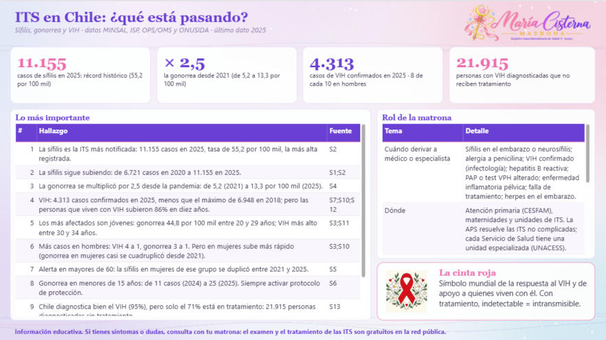
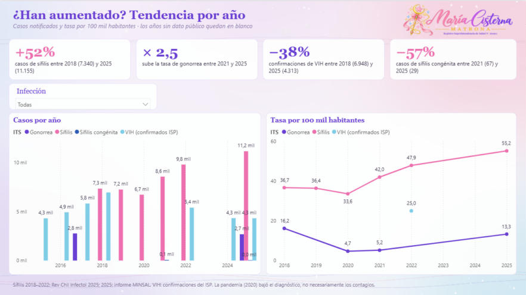
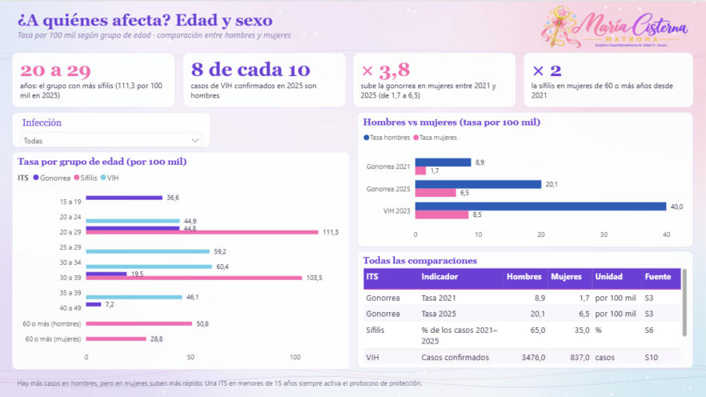
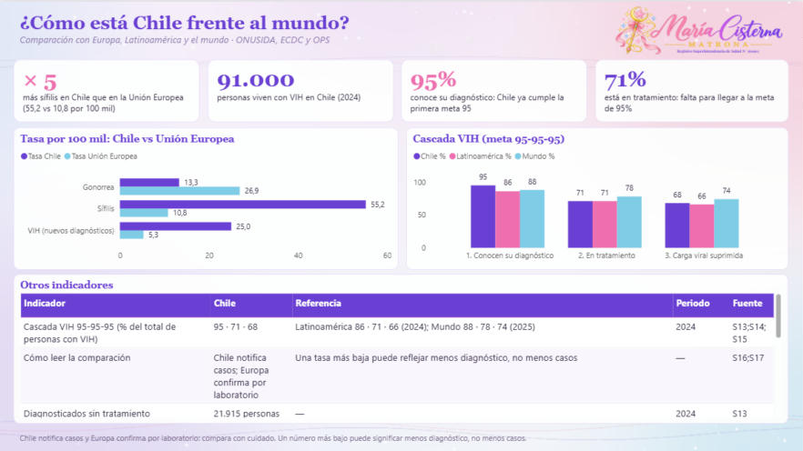

# 🩺 ITS en Chile

**María Cisterna Escobar · Matrona** — Registro Superintendencia de Salud N° 561993

   

---

## ✨ ¿Qué muestra?

Tendencias de sífilis, gonorrea y VIH; grupos de edad; hombres vs. mujeres; Chile frente a Europa, Latinoamérica y el mundo; guía rápida de cada ITS (síntomas, signos de alarma, cómo no confundirla, tratamiento, si se cura, prevención y quién atiende).

> 🌙 **Historia de datos interactiva:** está en la página `historia-its.html` de mi portafolio (repositorio **matrona**).

Cada página parte con sus indicadores clave (KPI) y la guía trae, para cada ITS, síntomas, signos de alarma, tratamiento, embarazo y quién atiende. La cinta roja explica el símbolo de la respuesta al VIH.

---

## 📌 Indicadores clave

| | Indicador | Qué significa |
|:---:|:---:|---|
| 🔺 | **11.155** | casos de sífilis en 2025: récord histórico |
| 📈 | **× 2,5** | sube la gonorrea desde 2021 |
| 🧪 | **4.313** | casos de VIH confirmados en 2025, 8 de cada 10 en hombres |
| 🎗️ | **95 · 71 · 68** | cascada VIH de Chile frente a la meta 95-95-95 |
| 👶 | **−57%** | casos de sífilis congénita entre 2021 y 2025 |
| 🌍 | **× 5** | más sífilis que en la Unión Europea |

---

## 🖼️ Vista del tablero

### Resumen

### Tendencias

### ¿A quiénes afecta?

### Chile y el mundo

### Guía de cada ITS

---

## 📁 Archivos

| | Archivo | Qué es |
|---|---|---|
| 🗂️ | `ITS_Chile_BaseDatos.xlsx` | **Base de datos** con todas las tablas y la hoja `Fuentes`. |
| 📊 | `ITS_Chile_MariaCisterna.pbix` | Tablero de **Power BI**. Ábrelo con Power BI Desktop (gratis). |
| 📈 | `ITS_Chile_MariaCisterna.twbx` | Tablero de **Tableau**. Ábrelo con Tableau Public o Tableau Reader (gratis). |
| 🧩 | `PowerBI_proyecto_pbip.zip` | **Proyecto editable** de Power BI (PBIP): descomprime y abre el `.pbip`. |

---

## 🧭 Páginas del tablero

1. **Resumen**
2. **Tendencias**
3. **¿A quiénes afecta?**
4. **Chile y el mundo**
5. **Guía de cada ITS**
6. **Fuentes**

---

## 🛠️ Cómo abrirlo

1. Descarga el repositorio: botón verde **Code → Download ZIP** y descomprímelo.
2. Abre `ITS_Chile_MariaCisterna.pbix` con **Power BI Desktop** (se descarga gratis desde Microsoft Store).
3. Si quieres actualizar los datos con tu copia del Excel: **Transformar datos → Administrar parámetros → RutaBaseDatos**, pega la ruta del `.xlsx` en tu computador y aprieta **Actualizar**.

> 💡 **Tip:** las páginas con lista a la izquierda son interactivas: elige una opción y el tablero cambia.

---

## 🗂️ Base de datos

`ITS_Chile_BaseDatos.xlsx` trae estas hojas: `Tendencias`, `EdadTasa`, `SexoComparacion`, `SexoTasas`, `ChileVsEuropa`, `CascadaVIH`, `Indicadores`, `GuiaClinica`, `Hallazgos`, `RolMatrona`, `SexoLargo`, `MundoLargo`, `CascadaLargo`, `GuiaLarga`, `Fuentes`.

Cada fila indica su fuente en la columna `FuenteID`. Si un año no tiene dato público, queda vacío: **no se inventaron cifras**.

---

## 📚 Fuentes

- **S1** · Rev Chil Infectol 2025. Caracterización epidemiológica de la sífilis en Chile 2018–2022 (datos de notificación MINSAL). — [enlace](https://revinf.cl/index.php/revinf/article/download/2492/1138)
- **S2** · MINSAL, Informe Epidemiológico Anual 2025 de sífilis (vía Meganoticias, 19-08-2026). — [enlace](https://www.meganoticias.cl/nacional/529712-sifilis-alcanza-record-historico-en-chile-casos-se-disparan-aumento-entre-adultos-mayores-y-mujeres-60-anos-19-08-2026.html)
- **S3** · MINSAL, reporte 2025 de sífilis y gonorrea (vía Emol, 12-07-2026). — [enlace](https://www.emol.com/noticias/Nacional/2026/07/12/1205310/sifilis-gonorrea-chile-reporte-minsal.html)
- **S4** · MINSAL, gonorrea y sífilis en jóvenes 2025 (vía BioBioChile, 06-07-2026). — [enlace](https://www.biobiochile.cl/noticias/salud-y-bienestar/cuerpo/2026/07/06/registro-mas-alto-de-la-decada-aumentan-los-contagios-de-gonorrea-y-sifilis-entre-jovenes-chilenos.shtml)
- **S5** · MINSAL, sífilis en personas de 60 años o más (vía BioBioChile, 19-08-2026). — [enlace](https://www.biobiochile.cl/noticias/nacional/chile/2026/08/19/sifilis-alcanza-record-en-chile-tasa-entre-mujeres-mayores-de-60-anos-se-duplico-en-cuatro-anos.shtml)
- **S6** · MINSAL, ITS en menores de 15 años (vía T13, 19-08-2026). — [enlace](https://www.t13.cl/noticia/nacional/aumento-ets-chile-destaca-incremento-gonorrea-menores-15-anos-sifilis-record-19-8-2026)
- **S7** · ISP, confirmación de VIH 2010–2019 (documento Cámara de Diputados). — [enlace](https://www.camara.cl/verDoc.aspx?prmID=172229&prmTIPO=DOCUMENTOCOMISION)
- **S8** · ISP, VIH 2022 (vía BioBioChile, 31-07-2023). — [enlace](https://www.biobiochile.cl/noticias/nacional/chile/2023/07/31/isp-casos-de-vih-aumenta-7-en-un-ano-y-mayor-tasa-de-diagnostico-esta-asociada-a-hombres.shtml)
- **S9** · ISP, VIH 2024 (vía El Ciudadano). — [enlace](https://www.elciudadano.com/?p=1117920)
- **S10** · ISP, VIH 2025 (vía El Desconcierto, 23-03-2026). — [enlace](https://eldesconcierto.cl/2026/03/23/vih-una-inercia-preocupante)
- **S11** · VIH 2023 por sexo y edad (vía El Mostrador, 01-12-2025). — [enlace](https://www.elmostrador.cl/agenda-pais/vida-en-linea/2025/12/01/vih-en-chile-expertos-alertan-fuerte-aumento-de-casos-en-jovenes-y-baja-percepcion-de-riesgo/)
- **S12** · ONUSIDA, personas que viven con VIH en Chile (vía The Clinic, 25-06-2026). — [enlace](https://www.theclinic.cl/2026/06/25/chile-registra-un-aumento-de-casos-de-vih-de-un-86-en-los-ultimos-10-anos-onu-alerta-sobre-riesgos-de-no-avanzar-en-prevencion-de-contagios/)
- **S13** · Cascada VIH Chile: diagnosticados sin tratamiento (vía BioBioChile, 03-09-2026). — [enlace](https://www.biobiochile.cl/noticias/nacional/chile/2026/09/03/alerta-por-vih-en-chile-mas-de-21-mil-diagnosticados-no-reciben-tratamiento.shtml)
- **S14** · ONUSIDA, informe Latinoamérica 2025. — [enlace](https://unaids.org.br/wp-content/uploads/2025/07/25-07-09-BLS25218-GR-RP-LATAM-PTBR-2.pdf)
- **S15** · ONUSIDA, ficha mundial. — [enlace](https://www.unaids.org/en/resources/fact-sheet)
- **S16** · ECDC, sífilis, informe anual 2024. — [enlace](https://www.ecdc.europa.eu/en/publications-data/syphilis-annual-epidemiological-report-2024)
- **S17** · ECDC, gonorrea, informe anual 2024. — [enlace](https://www.ecdc.europa.eu/en/publications-data/gonorrhoea-annual-epidemiological-report-2024)
- **S18** · ECDC, vigilancia de VIH/sida en Europa 2025 (datos 2024). — [enlace](https://www.ecdc.europa.eu/en/publications-data/hivaids-surveillance-europe-2025-2024-data)
- **S19** · OPS, perfil de país Chile. — [enlace](https://hia.paho.org/en/country-profiles/chile)
- **S20** · OPS, aumento de casos de sífilis en las Américas (22-05-2024). — [enlace](https://www.paho.org/es/noticias/22-5-2024-casos-sifilis-aumentan-americas)
- **S21** · OMS, nuevo informe: aumento importante de ITS (21-05-2024). — [enlace](https://www.who.int/news/item/21-05-2024-new-report-flags-major-increase-in-sexually-transmitted-infections---amidst-challenges-in-hiv-and-hepatitis)
- **S22** · MINSAL, Norma de Profilaxis, Diagnóstico y Tratamiento de las ITS (NT 187, 2016). — [enlace](https://diprece.minsal.cl/wrdprss_minsal/wp-content/uploads/2014/11/NORMA-GRAL.-TECNICA-N°-187-DE-PROFILAXIS-DIAGNOSTICO-Y-TRATAMIENTO-DE-LAS-ITS.pdf)
- **S23** · MINSAL, convenio con el Colegio de Matronas para prevención de VIH/ITS (2019). — [enlace](https://www.minsal.cl/?p=51074)
- **S24** · Protocolo de test rápido de VIH en Chile (vía Pauta). — [enlace](https://www.pauta.cl/cronica/como-funciona-el-protocolo-del-test-rapido-del-vih-chile)
- **S25** · MINSAL, Norma Técnica Hepatitis B y C (2025). — [enlace](https://diprece.minsal.cl/wp-content/uploads/2025/12/2025.12.05_NORMA-TECNICA-HEPATITIS-B-Y-C.pdf)
- **S26** · ChileAtiende, vacuna contra el VPH. — [enlace](https://chileatiende.gob.cl/fichas/36896-vacuna-contra-el-virus-del-papiloma-humano-vph)
- **S27** · OMS, notas descriptivas: sífilis, gonorrea, clamidia, tricomoniasis, herpes, VPH, hepatitis B, vaginosis bacteriana. — [enlace](https://www.who.int/news-room/fact-sheets)
- **S28** · CDC, guías de tratamiento de ITS 2021. — [enlace](https://www.cdc.gov/std/treatment-guidelines/)
- **S29** · Sífilis congénita 2021 y 2025 (vía La Ventana Ciudadana). — [enlace](https://laventanaciudadana.cl/vigilancia-epidemiologica-el-radar-de-la-salud-publica-frente-a-la-sifilis-en-chile/)
- **S30** · Gonorrea en Chile 2010–2017 (vía El Desconcierto, 2018). — [enlace](https://eldesconcierto.cl/2018/09/11/contagio-de-gonorrea-se-duplico-en-chile-durante-los-ultimos-siete-anos)
- **S35** · ISP: Boletín Resultados confirmación de infección por VIH, Chile 2010–2022 (informe oficial). — [enlace](https://www.ispch.gob.cl/boletin/resultados-confirmacion-de-infeccion-por-vih-chile-2010-2022/)
- **S36** · Rev Chil Infectol 2024: Situación epidemiológica de VIH a nivel global y nacional, puesta al día. — [enlace](https://www.scielo.cl/scielo.php?script=sci_arttext&pid=S0716-10182024000200248)
- **S37** · MINSAL, Departamento de Epidemiología: Situación epidemiológica de sífilis en Chile 2016 (Rev Chil Infectol 2018). — [enlace](https://www.scielo.cl/article_plus.php?pid=S0716-10182018000300284&tlng=es&lng=es)
- **S38** · Rev Chil Obstet Ginecol: Vigilancia epidemiológica de sífilis en Chile. — [enlace](https://www.scielo.cl/pdf/rchog/v78n5/art11.pdf)

---

## ⚠️ Aviso

Material educativo y de análisis de datos. **No reemplaza la consejería ni el control con un profesional de salud.**

## ©️ Derechos

© 2026 María Cisterna Escobar, matrona. Todos los derechos reservados: puedes ver y compartir el enlace, pero no copiar ni reutilizar el contenido sin autorización. Ver `LICENSE`.
