

<h1 align="center">🩺 ITS en Chile</h1>

<b>María Cisterna Escobar · Matrona</b> — Registro Superintendencia de Salud N° 561993

<a href="capturas/02_tendencias.png">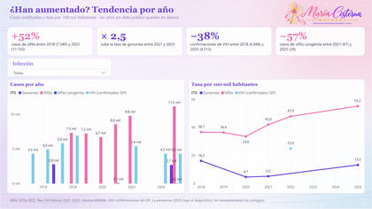</a> <a href="capturas/03_a_quienes_afecta.png">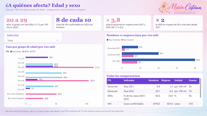</a> <a href="capturas/04_chile_y_el_mundo.png">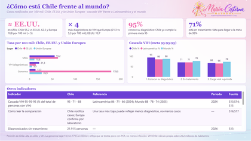</a>  <a href="capturas/05_guia_de_cada_its.png">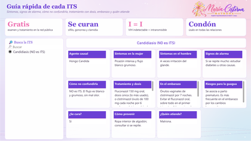</a>  <a href="capturas/07_que_mide_cada_kpi.png">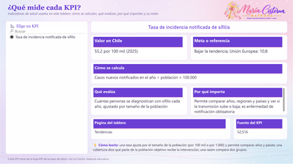</a>

---

## ✨ ¿Qué muestra?

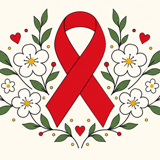 

Las ITS en Chile —sífilis, gonorrea, VIH, hepatitis B, clamidia, VPH, herpes, tricomoniasis, linfogranuloma venéreo y mpox—: cómo han aumentado, a quiénes afectan, cómo está Chile frente al mundo, una guía clínica de cada ITS y un **simulador** de lo que cambiaría con matronas haciendo educación sexual integral en los colegios.

Cada página parte con sus **indicadores clave (KPI)** y una página final explica **qué mide cada KPI, cómo se calcula y por qué importa**. Power BI y Tableau tienen las mismas páginas.

---

## 📌 KPI que uso y por qué

| KPI | Valor en Chile | Cómo se calcula | Qué evalúa | Por qué importa | Meta o referencia |
|---|---|---|---|---|---|
| **Tasa de incidencia notificada de sífilis** | 55,2 por 100 mil (2025) | Casos nuevos notificados en el año ÷ población × 100.000 | Cuántas personas se diagnostican con sífilis cada año, ajustado por tamaño de la población | Permite comparar años, regiones y países y ver si la transmisión sube o baja; es enfermedad de notificación obligatoria | Bajar la tendencia; Unión Europea: 10,8 |
| **Tasa de incidencia notificada de gonorrea** | 13,3 por 100 mil (2025) | Casos nuevos notificados en el año ÷ población × 100.000 | Magnitud y tendencia de la gonorrea | Su aumento alerta sobre relaciones sin condón y riesgo de resistencia a antibióticos | Bajar la tendencia; Unión Europea: 26,9 |
| **Nuevos diagnósticos de VIH confirmados** | 4.313 casos (2025) | Número de casos confirmados por el ISP en el año | Cuántas personas se diagnostican con VIH cada año | Mide la llegada al diagnóstico; más testeo puede subir el número aunque baje la transmisión | Reducir nuevas infecciones (ONUSIDA) |
| **Tasa de sífilis congénita** | 0,41 por 1.000 nacidos vivos | Casos de sífilis congénita ÷ nacidos vivos × 1.000 | Cuántas guaguas nacen con sífilis transmitida durante el embarazo | Es evitable con VDRL en el control prenatal y tratamiento oportuno de la gestante y su pareja | Eliminación OPS: ≤ 0,5 por 1.000 nacidos vivos |
| **Tasa específica por edad** | Sífilis 20 a 29: 111,3 por 100 mil | Casos del grupo de edad ÷ población de ese grupo × 100.000 | En qué edades se concentra cada ITS | Orienta dónde focalizar educación, testeo y anticoncepción con condón | — |
| **Razón de tasas hombre:mujer** | VIH 4,7 : 1 (2023) | Tasa en hombres ÷ tasa en mujeres | Cuántas veces más afecta a hombres que a mujeres | Muestra brechas por sexo y dónde crece más rápido (gonorrea en mujeres × 3,8) | — |
| **Cascada VIH 95-95-95: diagnóstico** | 95% conoce su diagnóstico | Personas diagnosticadas ÷ personas que viven con VIH × 100 | Qué parte de las personas con VIH sabe que lo tiene | Sin diagnóstico no hay tratamiento ni prevención de nuevos contagios | 95% (ONUSIDA 2030) |
| **Cascada VIH 95-95-95: tratamiento** | 71% en tratamiento | Personas en tratamiento antirretroviral ÷ personas que viven con VIH × 100 | Qué parte de las personas con VIH recibe tratamiento | Es el punto débil de Chile: 21.915 personas diagnosticadas no están en tratamiento | 95% (ONUSIDA 2030) |
| **Cascada VIH 95-95-95: carga viral suprimida** | 68% con carga viral suprimida | Personas con carga viral indetectable ÷ personas que viven con VIH × 100 | Qué parte logra que el virus no se detecte en sangre | Indetectable = intransmisible: es el KPI que mejor refleja el control de la epidemia | 95% (ONUSIDA 2030) |
| **Tasa de transmisión vertical de VIH** | 1,5% | Recién nacidos con VIH ÷ recién nacidos de madres con VIH × 100 | Cuántas guaguas adquieren el VIH de su madre | Mide la calidad del protocolo de prevención en el embarazo, el parto y la lactancia | < 2% (meta OPS de eliminación) |

---

## 🏫 Simulador: ¿qué pasaría con matronas en los colegios?

Página interactiva, en Power BI y en Tableau, para explorar escenarios de prevención:

- 🏫 **% de colegios con matrona:** qué parte de los colegios tendría una matrona haciendo educación sexual integral.
- 💊 **Anticonceptivos desde los 14 años:** si además se entregan métodos (la Ley 20.418 garantiza información y acceso; desde los 14 años la atención es confidencial).
- 📊 **Escenario de efecto:** 5% (conservador) o 10% (alto) menos nacimientos adolescentes, según la evidencia de acceso gratuito a DIU e implantes.
- 🛡️ **Más uso de condón:** cuántos puntos sube el uso de condón gracias a la educación; el condón usado siempre reduce cerca de 80% la transmisión del VIH.

El tablero calcula los **nacimientos adolescentes evitados**, la **tasa de 15 a 19 años proyectada** y los **casos de gonorrea y sífilis evitados**, y explica cómo ayuda la matrona: educación sexual integral, receta de DIU, implante y otros métodos (Ley 20.533), test rápido de VIH y sífilis y atención confidencial.

 

> ⚠️ Es una **simulación educativa con supuestos explícitos**, no una proyección oficial. La educación sola, sin acceso a métodos, no mostró un efecto claro en embarazos (Cochrane 2016): por eso el simulador separa los dos efectos.

---

## 🧭 Páginas del tablero

| Vista | Página | Qué encuentras |
|:---:|---|---|
| <a href="capturas/01_resumen.png">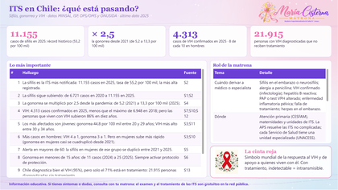</a> | 📊 **Resumen** | Indicadores clave, hallazgos y rol de la matrona. |
|  | 📈 **Tendencias** | Casos y tasa por año de cada ITS. |
|  | 👥 **¿A quiénes afecta?** | Edad y sexo. |
|  | 🌍 **Chile y el mundo** | Chile frente a EE.UU. y Europa, y cascada VIH 95-95-95. |
|  | 🧪 **Todas las ITS** | Las 10 ITS: qué se vigila en Chile y cuánto hay en el mundo. |
|  | 📖 **Guía de cada ITS** | Síntomas, alarma, tratamiento, embarazo y quién atiende. |
|  | 🏫 **Simulador: matronas en colegios** | Mueve los supuestos y mira cuántos casos se evitan. |
|  | 📐 **Qué mide cada KPI** | Fórmula, qué evalúa, por qué importa y meta. |
| | 📚 **Fuentes** | Referencias de cada cifra. |

---

## 📊 Vista del tablero en Power BI

### 📊 Resumen

Indicadores clave, hallazgos y rol de la matrona.

### 📈 Tendencias

Casos y tasa por año de cada ITS.

### 👥 ¿A quiénes afecta?

Edad y sexo.

### 🌍 Chile y el mundo

Chile frente a EE.UU. y Europa, y cascada VIH 95-95-95.

### 🧪 Todas las ITS

Las 10 ITS: qué se vigila en Chile y cuánto hay en el mundo.

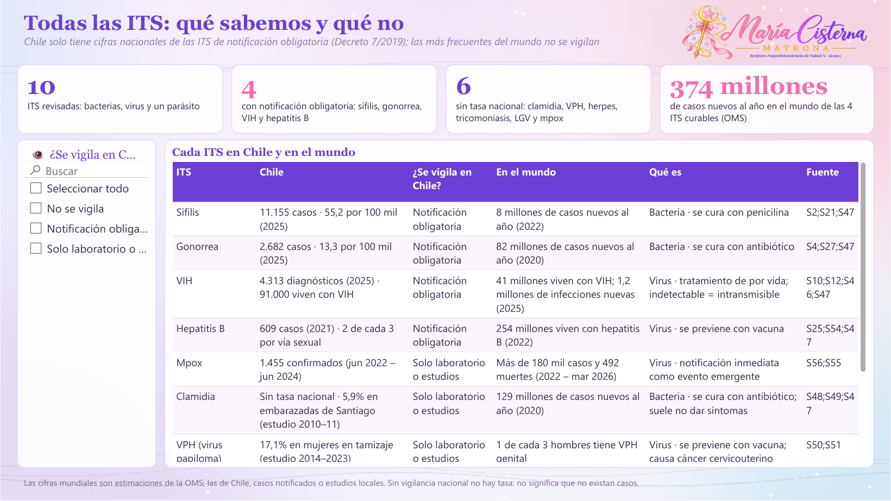

### 📖 Guía de cada ITS

Síntomas, alarma, tratamiento, embarazo y quién atiende.

### 🏫 Simulador: matronas en colegios

Mueve los supuestos y mira cuántos casos se evitan.

### 📐 Qué mide cada KPI

Fórmula, qué evalúa, por qué importa y meta.

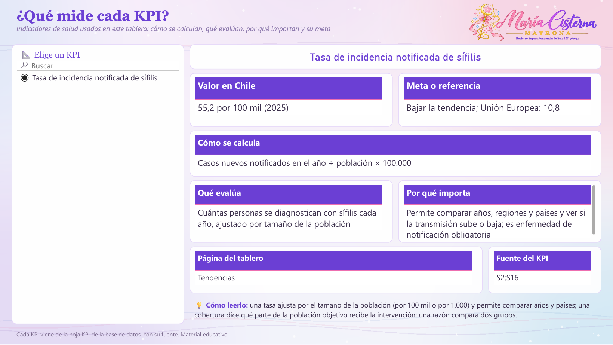

## 🎨 Vista del tablero en Tableau

El `.twbx` tiene las mismas páginas, con filtros, listas desplegables y controles deslizantes.

📊 <b>Resumen</b>

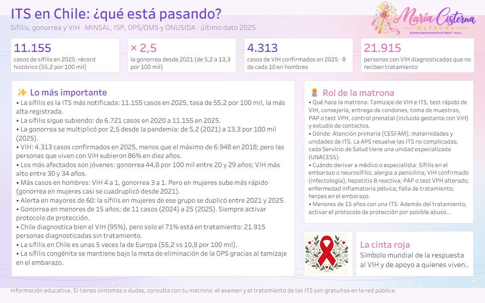

📈 <b>Tendencias</b>

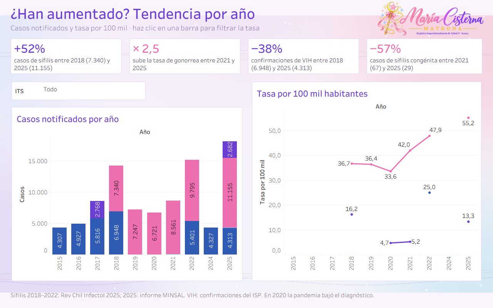

👥 <b>¿A quiénes afecta?</b>

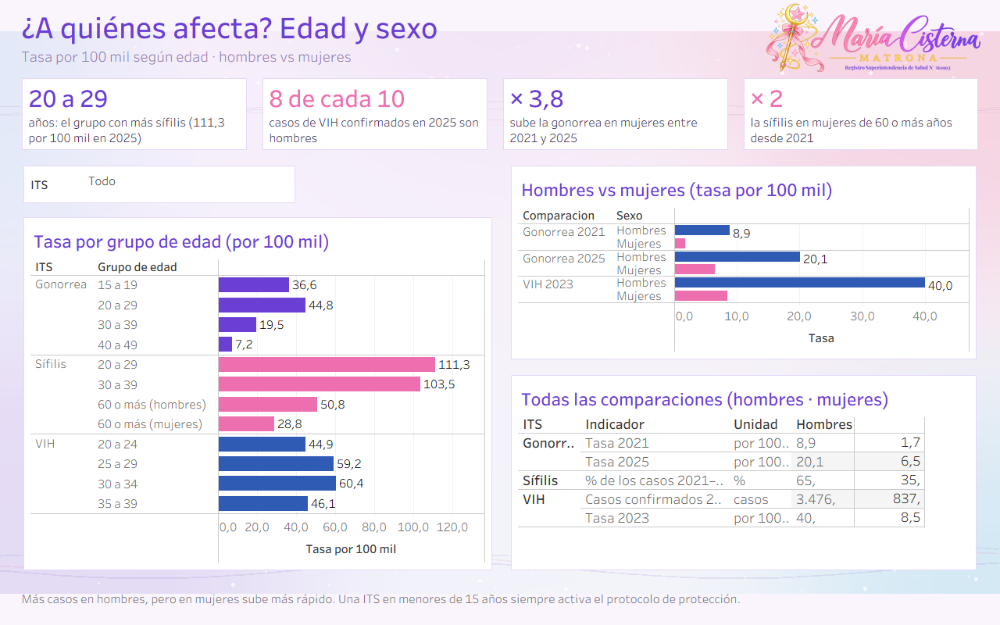

🌍 <b>Chile y el mundo</b>

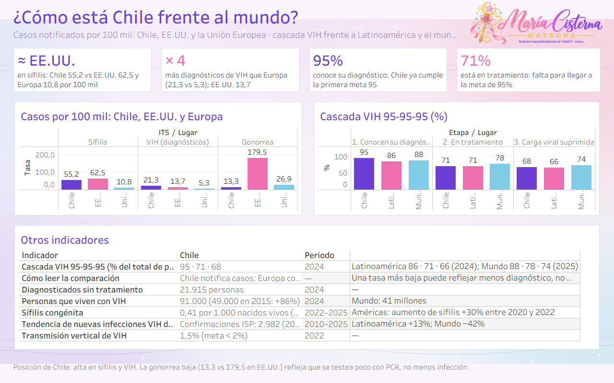

🧪 <b>Todas las ITS</b>

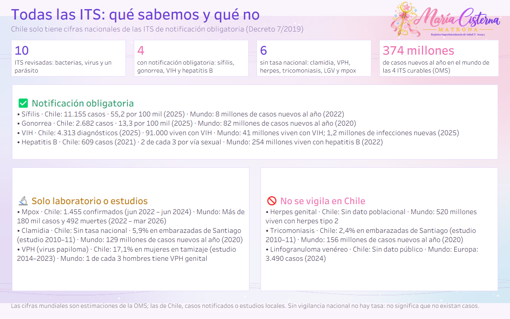

📖 <b>Guía de cada ITS</b>

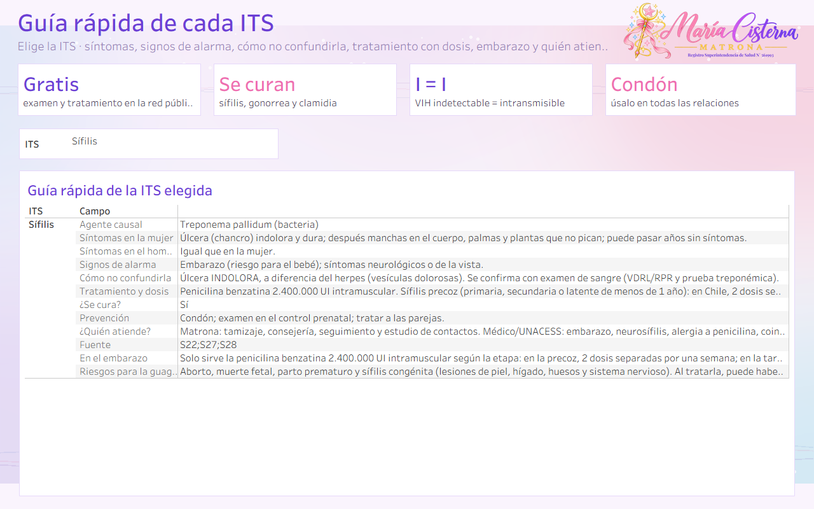

🏫 <b>Simulador: matronas en colegios</b>

📐 <b>Qué mide cada KPI</b>

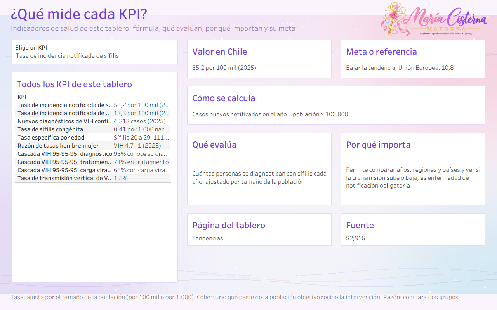

---

## 🎤 Presentación

La presentación [`Salud_Chile_en_datos_MariaCisterna.pptx`](../presentacion/Salud_Chile_en_datos_MariaCisterna.pptx) resume los cinco tableros: antes y ahora, Chile frente al mundo, métricas frente a sus metas, hallazgos, medidas y conclusiones.

---

## 📁 Archivos

| | Archivo | Qué es |
|:---:|---|---|
| 📊 | `ITS_Chile_MariaCisterna.pbix` | Tablero de **Power BI**. Ábrelo con Power BI Desktop (gratis). |
| 🎨 | `ITS_Chile_MariaCisterna.twbx` | Tablero de **Tableau**. Ábrelo con Tableau Public o Tableau Desktop. |
| 🧩 | `PowerBI_proyecto_pbip.zip` | **Proyecto editable** de Power BI (PBIP): descomprime y abre el `.pbip`. |
| 🗂️ | `ITS_Chile_BaseDatos.xlsx` | **Base de datos** con todas las tablas, la hoja `KPI` y la hoja `Fuentes`. |
| 🖼️ | `capturas/` | Imágenes de cada página en Power BI y en Tableau, y miniaturas en `capturas/mini/`. |
| 🎀 | `recursos/` | Logo con registro y fondo usados en los tableros. |

---

## 🛠️ Cómo abrirlo

1. Descarga el repositorio: botón verde **Code → Download ZIP** y descomprímelo.
2. **Power BI:** abre `ITS_Chile_MariaCisterna.pbix`. Para actualizar con tu copia del Excel: **Transformar datos → Administrar parámetros → RutaBaseDatos**, pega la ruta del `.xlsx` y aprieta **Actualizar**.
3. **Tableau:** abre `ITS_Chile_MariaCisterna.twbx`; los datos ya vienen incluidos.

> 💡 **Tip:** las listas de la izquierda, los menús desplegables y los controles deslizantes son interactivos: elige una opción y el tablero cambia.

---

## 🗂️ Base de datos

`ITS_Chile_BaseDatos.xlsx` trae estas hojas: `Tendencias`, `EdadTasa`, `SexoComparacion`, `SexoTasas`, `ChileVsEuropa`, `CascadaVIH`, `Indicadores`, `GuiaClinica`, `Hallazgos`, `RolMatrona`, `SexoLargo`, `MundoLargo`, `CascadaLargo`, `GuiaLarga`, `KPI`, `KPILargo`, `SimColegios`, `SimAcceso`, `SimEfecto`, `SimCondon`, `SimIndicadores`, `SimSupuestos`, `TodasITS`, `ChileMundoITS`, `Fuentes`.

Cada fila indica su fuente en la columna `FuenteID`. Si un año no tiene dato público, queda vacío: **no se inventaron cifras**.

---

## 📚 Fuentes

- **S1** · Rev Chil Infectol 2025. Caracterización epidemiológica de la sífilis en Chile 2018–2022 (datos de notificación MINSAL). — [enlace](https://revinf.cl/index.php/revinf/article/download/2492/1138)
- **S2** · MINSAL, Informe Epidemiológico Anual 2025 de sífilis (vía Meganoticias, 19-08-2026). — [enlace](https://www.meganoticias.cl/nacional/529712-sifilis-alcanza-record-historico-en-chile-casos-se-disparan-aumento-entre-adultos-mayores-y-mujeres-60-anos-19-08-2026.html)
- **S3** · MINSAL, reporte 2025 de sífilis y gonorrea (vía Emol, 12-07-2026). — [enlace](https://www.emol.com/noticias/Nacional/2026/07/12/1205310/sifilis-gonorrea-chile-reporte-minsal.html)
- **S4** · MINSAL, gonorrea y sífilis en jóvenes 2025 (vía BioBioChile, 06-07-2026). — [enlace](https://www.biobiochile.cl/noticias/salud-y-bienestar/cuerpo/2026/07/06/registro-mas-alto-de-la-decada-aumentan-los-contagios-de-gonorrea-y-sifilis-entre-jovenes-chilenos.shtml)
- **S5** · MINSAL, sífilis en personas de 60 años o más (vía BioBioChile, 19-08-2026). — [enlace](https://www.biobiochile.cl/noticias/nacional/chile/2026/08/19/sifilis-alcanza-record-en-chile-tasa-entre-mujeres-mayores-de-60-anos-se-duplico-en-cuatro-anos.shtml)
- **S6** · MINSAL, ITS en menores de 15 años (vía T13, 19-08-2026). — [enlace](https://www.t13.cl/noticia/nacional/aumento-ets-chile-destaca-incremento-gonorrea-menores-15-anos-sifilis-record-19-8-2026)
- **S7** · ISP, confirmación de VIH 2010–2019 (documento Cámara de Diputados). — [enlace](https://www.camara.cl/verDoc.aspx?prmID=172229&prmTIPO=DOCUMENTOCOMISION)
- **S8** · ISP, VIH 2022 (vía BioBioChile, 31-07-2023). — [enlace](https://www.biobiochile.cl/noticias/nacional/chile/2023/07/31/isp-casos-de-vih-aumenta-7-en-un-ano-y-mayor-tasa-de-diagnostico-esta-asociada-a-hombres.shtml)
- **S9** · ISP, VIH 2024 (vía El Ciudadano). — [enlace](https://www.elciudadano.com/?p=1117920)
- **S10** · ISP, VIH 2025 (vía El Desconcierto, 23-03-2026). — [enlace](https://eldesconcierto.cl/2026/03/23/vih-una-inercia-preocupante)
- **S11** · VIH 2023 por sexo y edad (vía El Mostrador, 01-12-2025). — [enlace](https://www.elmostrador.cl/agenda-pais/vida-en-linea/2025/12/01/vih-en-chile-expertos-alertan-fuerte-aumento-de-casos-en-jovenes-y-baja-percepcion-de-riesgo/)
- **S12** · ONUSIDA, personas que viven con VIH en Chile (vía The Clinic, 25-06-2026). — [enlace](https://www.theclinic.cl/2026/06/25/chile-registra-un-aumento-de-casos-de-vih-de-un-86-en-los-ultimos-10-anos-onu-alerta-sobre-riesgos-de-no-avanzar-en-prevencion-de-contagios/)
- **S13** · Cascada VIH Chile: diagnosticados sin tratamiento (vía BioBioChile, 03-09-2026). — [enlace](https://www.biobiochile.cl/noticias/nacional/chile/2026/09/03/alerta-por-vih-en-chile-mas-de-21-mil-diagnosticados-no-reciben-tratamiento.shtml)
- **S14** · ONUSIDA, informe Latinoamérica 2025. — [enlace](https://unaids.org.br/wp-content/uploads/2025/07/25-07-09-BLS25218-GR-RP-LATAM-PTBR-2.pdf)
- **S15** · ONUSIDA, ficha mundial. — [enlace](https://www.unaids.org/en/resources/fact-sheet)
- **S16** · ECDC, sífilis, informe anual 2024. — [enlace](https://www.ecdc.europa.eu/en/publications-data/syphilis-annual-epidemiological-report-2024)
- **S17** · ECDC, gonorrea, informe anual 2024. — [enlace](https://www.ecdc.europa.eu/en/publications-data/gonorrhoea-annual-epidemiological-report-2024)
- **S18** · ECDC, vigilancia de VIH/sida en Europa 2025 (datos 2024). — [enlace](https://www.ecdc.europa.eu/en/publications-data/hivaids-surveillance-europe-2025-2024-data)
- **S19** · OPS, perfil de país Chile. — [enlace](https://hia.paho.org/en/country-profiles/chile)
- **S20** · OPS, aumento de casos de sífilis en las Américas (22-05-2024). — [enlace](https://www.paho.org/es/noticias/22-5-2024-casos-sifilis-aumentan-americas)
- **S21** · OMS, nuevo informe: aumento importante de ITS (21-05-2024). — [enlace](https://www.who.int/news/item/21-05-2024-new-report-flags-major-increase-in-sexually-transmitted-infections---amidst-challenges-in-hiv-and-hepatitis)
- **S22** · MINSAL, Norma de Profilaxis, Diagnóstico y Tratamiento de las ITS (NT 187, 2016). — [enlace](https://diprece.minsal.cl/wrdprss_minsal/wp-content/uploads/2014/11/NORMA-GRAL.-TECNICA-N°-187-DE-PROFILAXIS-DIAGNOSTICO-Y-TRATAMIENTO-DE-LAS-ITS.pdf)
- **S23** · MINSAL, convenio con el Colegio de Matronas para prevención de VIH/ITS (2019). — [enlace](https://www.minsal.cl/?p=51074)
- **S24** · Protocolo de test rápido de VIH en Chile (vía Pauta). — [enlace](https://www.pauta.cl/cronica/como-funciona-el-protocolo-del-test-rapido-del-vih-chile)
- **S25** · MINSAL, Norma Técnica Hepatitis B y C (2025). — [enlace](https://diprece.minsal.cl/wp-content/uploads/2025/12/2025.12.05_NORMA-TECNICA-HEPATITIS-B-Y-C.pdf)
- **S26** · ChileAtiende, vacuna contra el VPH. — [enlace](https://chileatiende.gob.cl/fichas/36896-vacuna-contra-el-virus-del-papiloma-humano-vph)
- **S27** · OMS, notas descriptivas: sífilis, gonorrea, clamidia, tricomoniasis, herpes, VPH, hepatitis B, vaginosis bacteriana. — [enlace](https://www.who.int/news-room/fact-sheets)
- **S28** · CDC, guías de tratamiento de ITS 2021. — [enlace](https://www.cdc.gov/std/treatment-guidelines/)
- **S29** · Sífilis congénita 2021 y 2025 (vía La Ventana Ciudadana). — [enlace](https://laventanaciudadana.cl/vigilancia-epidemiologica-el-radar-de-la-salud-publica-frente-a-la-sifilis-en-chile/)
- **S30** · Gonorrea en Chile 2010–2017 (vía El Desconcierto, 2018). — [enlace](https://eldesconcierto.cl/2018/09/11/contagio-de-gonorrea-se-duplico-en-chile-durante-los-ultimos-siete-anos)
- **S35** · ISP: Boletín Resultados confirmación de infección por VIH, Chile 2010–2022 (informe oficial). — [enlace](https://www.ispch.gob.cl/boletin/resultados-confirmacion-de-infeccion-por-vih-chile-2010-2022/)
- **S36** · Rev Chil Infectol 2024: Situación epidemiológica de VIH a nivel global y nacional, puesta al día. — [enlace](https://www.scielo.cl/scielo.php?script=sci_arttext&pid=S0716-10182024000200248)
- **S37** · MINSAL, Departamento de Epidemiología: Situación epidemiológica de sífilis en Chile 2016 (Rev Chil Infectol 2018). — [enlace](https://www.scielo.cl/article_plus.php?pid=S0716-10182018000300284&tlng=es&lng=es)
- **S38** · Rev Chil Obstet Ginecol: Vigilancia epidemiológica de sífilis en Chile. — [enlace](https://www.scielo.cl/pdf/rchog/v78n5/art11.pdf)
- **S39** · Weller S, Davis K. Condom effectiveness in reducing heterosexual HIV transmission. Cochrane Database Syst Rev 2002 (reducción cercana a 80%). — [enlace](https://doi.org/10.1002/14651858.CD003255)
- **S40** · Ley 20.418 (2010): normas sobre información, orientación y prestaciones en materia de regulación de la fertilidad. — [enlace](https://www.bcn.cl/leychile/navegar?idNorma=1010482)
- **S41** · Lindo y Packham (UC Davis): acceso a anticonceptivos de larga duración y nacimientos adolescentes. — [enlace](https://www.nber.org/papers/w21544)
- **S42** · Mason-Jones et al., Cochrane 2016: educación sexual escolar para prevenir ITS y embarazo. — [enlace](https://doi.org/10.1002/14651858.CD006417.pub3)
- **S43** · OMS, nota descriptiva: educación sexual integral. — [enlace](https://www.who.int/news-room/questions-and-answers/item/comprehensive-sexuality-education)
- **S44** · CDC, Sexually Transmitted Infections Surveillance 2023 (tasas de sífilis, gonorrea y clamidia en EE.UU.). — [enlace](https://www.cdc.gov/sti-statistics/annual/index.html)
- **S45** · CDC, HIV Surveillance Report: diagnósticos de VIH 2023 en EE.UU. — [enlace](https://stacks.cdc.gov/view/cdc/177771)
- **S46** · ONUSIDA, ficha mundial 2026 (datos 2025). — [enlace](https://www.unaids.org/sites/default/files/2026-06/20260612_Global_HIV_Factsheet.pdf)
- **S47** · Decreto 7/2019 MINSAL: reglamento de enfermedades de notificación obligatoria. — [enlace](https://www.diariooficial.interior.gob.cl/publicaciones/2020/01/24/42561/01/1715587.pdf)
- **S48** · Rev Chil Infectol 2012: Chlamydia trachomatis y Trichomonas vaginalis en embarazadas de Santiago. — [enlace](https://pesquisa.bvsalud.org/gim/resource/en/lil-660024)
- **S49** · OMS, nota descriptiva: clamidia. — [enlace](https://www.who.int/news-room/fact-sheets/detail/chlamydia)
- **S50** · Rev Méd Chile 2026: prevalencia de VPH en mujeres en tamizaje (Huechuraba 2014–2023). — [enlace](https://www.revistamedicadechile.cl/)
- **S51** · OMS 2023: uno de cada tres hombres en el mundo tiene VPH genital. — [enlace](https://www.who.int/news/item/01-09-2023-one-in-three-men-worldwide-are-infected-with-genital-human-papillomavirus)
- **S52** · OMS 2024: más de 1 de cada 5 adultos en el mundo tiene herpes genital. — [enlace](https://www.who.int/news/item/11-12-2024-over-1-in-5-adults-worldwide-has-a-genital-herpes-infection-who)
- **S53** · OMS, nota descriptiva: tricomoniasis. — [enlace](https://www.who.int/news-room/fact-sheets/detail/Trichomoniasis)
- **S54** · OPS/OMS 2024: hepatitis virales en el mundo (Informe mundial de hepatitis 2024). — [enlace](https://www.paho.org/en/news/10-4-2024-who-sounds-alarm-viral-hepatitis-infections-claiming-3500-lives-each-day)
- **S55** · OPS, actualización epidemiológica de mpox (abril 2026). — [enlace](https://www.paho.org/sites/default/files/2026/04/23042026actualizacion-epi-mpoxesfinal.pdf)
- **S56** · MINSAL, casos de mpox en Chile 2022–2024 (vía El Dínamo, 14-08-2024). — [enlace](https://www.eldinamo.cl/sociedad/2024/08/14/oms-declara-emergencia-sanitaria-internacional-por-viruela-del-mono-cuantos-casos-hay-en-chile-y-como-se-contagia/)
- **S57** · ECDC, linfogranuloma venéreo, informe anual 2024. — [enlace](https://www.ecdc.europa.eu/en/publications-data/lymphogranuloma-venereum-annual-epidemiological-report-2024)

---

## ⚠️ Aviso

Material educativo y de análisis de datos. **No reemplaza la consejería ni el control con un profesional de salud.**

## ©️ Derechos

© 2026 María Cisterna Escobar, matrona. Todos los derechos reservados: puedes ver y compartir el enlace, pero no copiar ni reutilizar el contenido sin autorización. Ver `LICENSE`.
